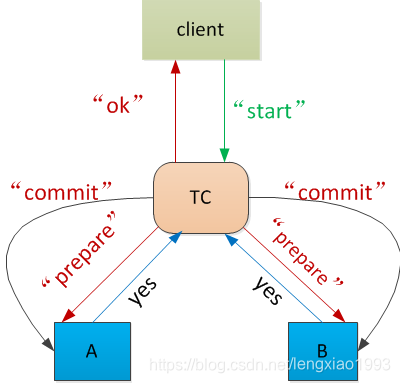

# 
 2PC

## 概述

**作用**：两阶段提交是为了保证分布式系统中不同节点事务提交时的一致性。

**角色**：两阶段提交中的角色是协调者（TM）和参与者（RM）。

**工作流程**：两阶段提交中的两阶段，分别是准备阶段和提交/回滚阶段

- 准备阶段：准备阶段的工作有3个
	1. 协调者发送pre请求给rm，包含事务相关信息
	2. 参与者执行本地事务，但不提交
	3. 参与者将是否可以提交反馈给协调者
- 提交阶段
	- commit
		1. 如果所有参与者都返回可以提交，则事务协调者向所有参与者发送Commit命令
		2. 参与者收到Commit命令后，执行本地事务的提交操作，并释放资源。
	- rollback
		1. 如果任何一个参与者返回不能提交，则事务协调者向所有参与者发送Rollback命令。
		2. 参与者收到Rollback命令后，执行本地事务的回滚操作，并释放资源。

**意义**

	一致性保证：确保分布式事务的一致性和可靠性。
	简单性：通过将事务的决策权集中在一个协调者上，避免了多个节点之间复杂的协商和同步。
	广泛支持：许多主流数据库都支持2PC协议，如MySQL的XA事务就是基于2PC实现的。

##缺点和改进

**缺点**

- 性能问题：由于需要等待所有参与者的响应，当参与者数量较多时，可能会导致协议执行时间较长，影响系统性能。
- 可靠性问题：如果事务协调者在第二阶段出现故障或网络异常，可能导致事务无法提交或回滚，影响系统可靠性。
- 阻塞问题：在准备阶段和提交阶段，所有参与者都处于阻塞状态，直到事务提交或回滚，这会影响系统的可用性。
- 单点故障问题：2PC协议对协调者节点的单点故障不具备容错性，如果协调者发生故障，整个事务可能无法继续进行。

**改进方案**：如三阶段提交（3PC）和基于消息队列的事务消息等

## 分析
在分布式系统中，或者说多个系统或服务之间进行交互的时候，我们通常希望有一个原子性的提交协议，要么就是全部成功，要么就全部失败，全部失败就是当有一者失败以后，对其他进行回滚。

常见的场景就是跨行转账，A行->B行。当A扣减成功以后，B增加成功，转账过程完成，当有A扣减成功，B行增加失败的时候，A扣减回滚。 B失败的原因可能是业务上的，比如B的账户被冻结无法使用，也可能是系统上的，比如B行节点down机，或者服务异常。

流程如下
 

上面的流程看似简单， 但是有一个点容易被忽略：

- 当 TC 收到 A 和 B 响应 “Yes” 后， 做出了 “commit” 的决定， 向 A /B 发送指令或， 并不需要再等待 A/B 的响应， 可以直接向 client 返回成功
- 之所以可以这样做的原因是， 当 A/B 返回 Yes 后， 就代表 A 和 B 都做好了提交准备， 只要 TC 决定要提交，即使 A/B 宕机， 没有收到 TC 的 Commit 指令， 只要 A/B 被修复重启， A 和 B 都必须有能力成功完成提交操作。

### 原子提交协议希望实现的2个特性
1、由上面的场景， 我们可以总结出所有原子提交协议希望实现的2个特性

- 安全性（Safety）
如果任意一方 commit， 所有人必须都 commit
如果任意一方中断，则没有任何一个人进行 commit
- 存活性（Liveness）
没有宕机或失败发生时， A 和 B 都能提交， 则提交
如果发生失败时，最终能达成一个一致性结果（成功/失败）， 予以响应， 不能一直等待

2、二阶段提交协议如何满足安全性和存活性

满足安全性

- 事务协调者 TC，作为一个中心， 统一收集了 A 和 B 是否有意愿（有能力）进行 commit
- 事务协调者 TC 强制保证了， A， B 双方必须都有意愿提交时， 才进行 commit

满足存活性：**二阶段提交无法满足存活性**

### 2PC的问题

问题1： 响应超时

	结点正常运行， 但是没有正常收到它所期待的响应， 可能原因如下
	1、其他的结点故障了
	2、网络情况不好， 数据包丢失了或网络干脆中断了

问题2： 重启

	结点宕机， 重启以后， 如何恢复被中断的操作

####超时

整个协议里面有哪些等待操作？

##### 等待状态超时
等待状态超时的时候， 是否有办法继续协议

事务协调者 TC 需要等待 A 和 B 返回 “yes”/“no” 超时：

A 和 B 需要等待 TC 发送 “commit”/ “abort” 指令 超时：

超时终止协议

- B 向 A 发送状态查询请求， 询问 A 是否知道事务已经提交
- 如果 B没有收到 A 的响应， B 无法进行后续操作， 只能继续等待
- 如果 B 收到了 A 的响应， 则分如下几种情况：
	- A 回复说 ， 它已经收到了来自 TC 的 “commit”/ “abort” 指令
	
			此时 B 可以执行 “commit”/ “abort”, 应为 TC 发给 B 的指令肯定和 A 一样
	- A 回复说， 它还没有向 TC 回复 “yes”/“no”,
			
			此时 B 和 A 都直接执行 abort 操作
			不必担心 TC， 因为 TC 尚未收到 A 的回复， 最终会根据 A 和B 的状态回复 client
	- A 回复说， 它向 TC 回复了 “no”
此时 B 和 A 都直接执行 abort 操作
	- A 回复说， 它向 TC 回复了 “yes”
		- 此时 B 不能进行后续操作

				因为 TC 可能已经收到了 A 和 B 的 “Yes” 响应， 
				并且决定执行 “commit”, 向 A 和 B 发送了“commit” 指令， 
				只是没被 A 和 B 收到， 
				但是 TC 发送 “commit” 之后就会直接向客户端返回了 “ok” 
			
				TC 也有可能在等待 A 和 B 的响应过程中超时了， 
				直接进行了 “abort” 决定， 
				向 A 和 B 发送了 “abort” 指令， 
				只是没被 A 和 B 收到， 但是 TC 发送 “abort” 之后就会直接向客户端返回了 “fail”

> 转载自：https://blog.csdn.net/lengxiao1993/article/details/88290514