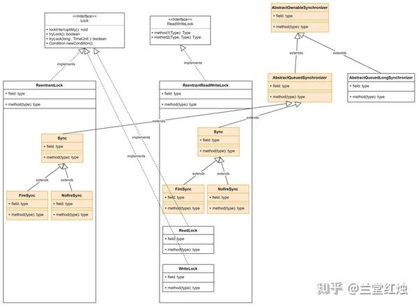
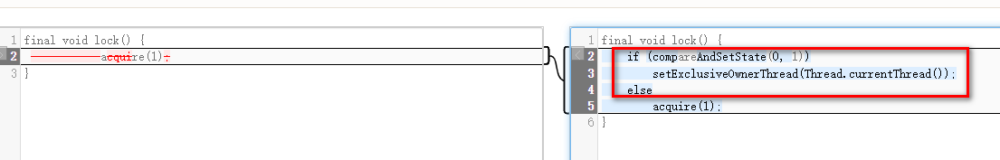
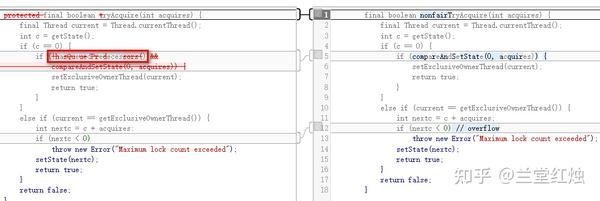
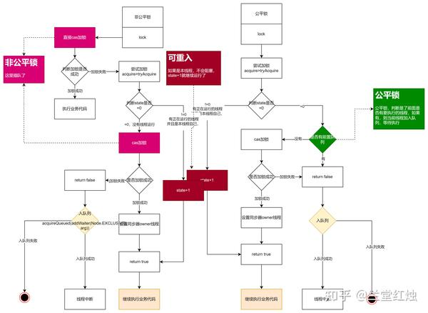

# Java公平锁是怎么实现公平的

 **Author:** [兰堂红烛]

 **Link:** [https://zhuanlan.zhihu.com/p/685053458]

在上一篇我们讲到了Java的并发体系。其中volilate和synchronized都可以实现并发控制，其中volilate可以保证有序性和可见性，不能保证原子性，而synchronized可以实现可见性、有序性和原子性。另外java还提供了juc并发框架，其中lock体系可以更加细致的对并发进行控制。在lock体系中，可重入锁和读写锁都实现了公平锁和非公平锁。详细见[https://zhuanlan.zhihu.com/p/684407108](https://zhuanlan.zhihu.com/p/684407108) 本篇我们将探究可重入锁和读写锁是如何实现公平和非公平的。

我们回顾一下，在Java的juc框架中的lock体系框架

  
其中，公平锁和非公平锁是两个不同的同步器，在ReentrantLock和ReentrantReadWriteLock中都做了实现。

我们先看ReentrantLock中的同步器。ReentrantLock中，默认的是非公平锁，见默认构造函数


```
public ReentrantLock() {
    sync = new NonfairSync();
}
```
可以通过传入一个bollean变量来指定为公平锁，在构建的时候传入true即可。


```
public ReentrantLock(boolean fair) {
    sync = fair ? new FairSync() : new NonfairSync();
}
```
  


我们再来看在FireSync和NonfireSync中是如何获取锁从而实现公平和非公平的。

## 非公平锁NonfireSync  

```
final void lock() {
	if (compareAndSetState(0, 1))
		setExclusiveOwnerThread(Thread.currentThread());
	else
		acquire(1);
}
AQS
public final void acquire(int arg) {
	if (!tryAcquire(arg) &&
		acquireQueued(addWaiter(Node.EXCLUSIVE), arg))
		selfInterrupt();
}
FireSync
protected final boolean tryAcquire(int acquires) {
	return nonfairTryAcquire(acquires);
}
//Sync中非公平实现
final boolean nonfairTryAcquire(int acquires) {
	final Thread current = Thread.currentThread();
	int c = getState();
	if (c == 0) {
		if (compareAndSetState(0, acquires)) {
			setExclusiveOwnerThread(current);
			return true;
		}
	}
	else if (current == getExclusiveOwnerThread()) {
		int nextc = c + acquires;
		if (nextc < 0) // overflow
			throw new Error("Maximum lock count exceeded");
		setState(nextc);
		return true;
	}
	return false;
}
```
  


## 公平锁FireSync  

```
FireSync中的加锁实现
final void lock() {
            acquire(1);
}
AQS中的请求锁的方法
public final void acquire(int arg) {
	if (!tryAcquire(arg) &&
		acquireQueued(addWaiter(Node.EXCLUSIVE), arg))
		selfInterrupt();
}
FireSync中的tryAcquire实现
protected final boolean tryAcquire(int acquires) {
	final Thread current = Thread.currentThread();
	int c = getState();
	if (c == 0) {
		if (!hasQueuedPredecessors() &&
			compareAndSetState(0, acquires)) {
			setExclusiveOwnerThread(current);
			return true;
		}
	}
	else if (current == getExclusiveOwnerThread()) {
		int nextc = c + acquires;
		if (nextc < 0)
			throw new Error("Maximum lock count exceeded");
		setState(nextc);
		return true;
	}
	return false;
}

```
相比起非公平锁，区别是非公平锁

  


图1，左边是公平锁，右边是非公平锁

  
  
  


图2，左边是公平锁，右边是非公平锁

  
  
图1可以看出，公平锁是调用acquire请求锁资源，而非公平锁在加锁的时候是直接加锁compareAndSetState(0, 1)。区别就是，非公平锁没有经过队列，如果加锁的时候，正好其他线程执行完了，此线程就直接获取到了锁资源。

图2可以看出，公平锁调用hasQueuedPredecessors对队列进行了判断。而非公平锁没有这个判断。hasQueuedPredecessors判断了是否有前置任务，当锁没有被占用，并且没有前置任务的时候，会加锁。而非公平锁当没有前置任务会直接加锁。


```
public final boolean hasQueuedPredecessors() {
	// The correctness of this depends on head being initialized
	// before tail and on head.next being accurate if the current
	// thread is first in queue.
	Node t = tail; // Read fields in reverse initialization order
	Node h = head;
	Node s;
	return h != t &&
		((s = h.next) == null || s.thread != Thread.currentThread());
}
```
  


由此，我们可以总结出以下的流程图，来详细说明，为什么是公平，为什么不公平

  
  


总结：在公平锁种，加锁的时候，会判断前面是否有线程需要执行，如果有，会把本线程加载CHL队列的尾部。而在非公平锁中，在加锁的时候，有2个地方插队了。第一个地方时加锁开始的时候，另一个地方是没有现成执行（c=0）时，尝试获取锁。

