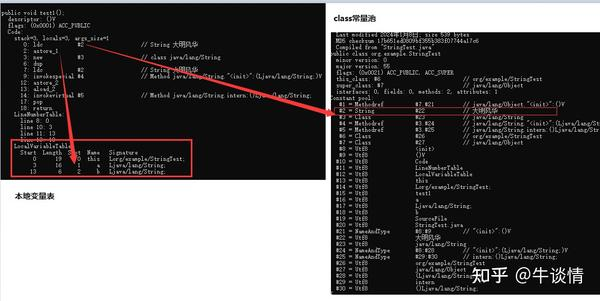
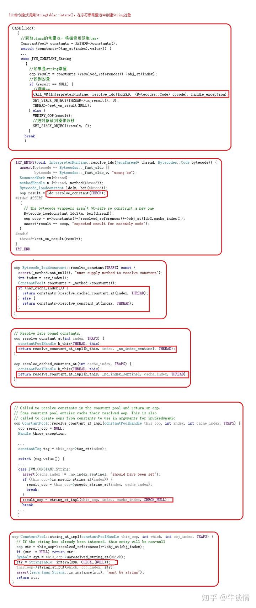
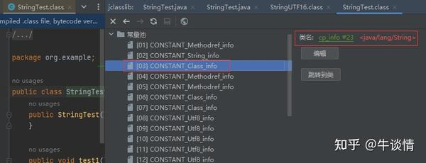
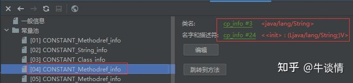
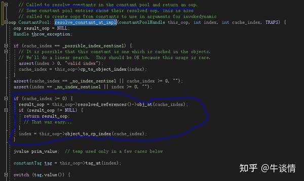

# Java深度探究：String类型分析

 **Author:** [兰堂红烛]

 **Link:** [https://zhuanlan.zhihu.com/p/676448528]

本文主要说明的内容

* string类的源码几个特点：value类型、final修饰。
* jvm中string是怎么存的

## 1 string类的源码几个特点  
### 1.1 string的value类型  
在java中，string是代表字符串的类，字符的串。这个串在string中就是一个数组。所以String中放了一个字符数组。 当然字符数组最终也是字节，jdk1.8及以前String使用的是char数组，jdk1.9及以后使用的是byte数组[https://openjdk.org/jeps/254](https://openjdk.org/jeps/254)。


```
private final byte[] value;
```
**这个char和byte有什么区别呢？**

byte 是字节数据类型 ，是有符号型的，**占1 个字节**；大小范围为-128~127 。char 是字符数据类型 ，是无符号型的，**占2字节**(Unicode码 ）；大小范围 是0~65535 ；char是一个16位二进制的Unicode字符，JAVA用char来表示一个字符。

为什么有这个改动呢？我们知道java的jvm内存中对字符编码是使用的unicode[#ref\_1](#ref\_1)。也就是在编译以后，形成的字节码中，就已经形成了以unicode编码后的二进制字节码文件也就是class文件，在jvm启动的时候被加载到内存中。而unicode刚好是2个字节，也就是使用unicode的时候，char是可以覆盖所有的字符的。

但是有些时候，字符是不需要2个字节的，1个字节就够了。比如ascii和Latin1编码都是单字节编码，占用1个字节。1个字节的时候，就是8位，8位可以表示的范围是二进制0b00000000～0b11111111，16进制0x00到0xFF。可以表示的就是2^8=256个字符。这个8位包含一些因为的符号、数字、大写字母和小写字母，这些是兼容ascii的，比ascii多的是西欧、希腊、阿拉伯、希伯来等这些语言对应的文字符号[#ref\_2](#ref\_2)。我们其实大部分编程的时候使用的都是这些，我们申请字符串的时候也是这些。比如定义变了名，标识符的时候。很少使用到中文。（使用到中文的时候都因为要输入输出。比如读取文本文字，显示文字等，这些时候就涉及到一个编码转换，比如你在txt文件里存了中文，文件是用utf8或者gbk编码的，那先要读出来，再转成unicode放到jvm内存里，使用了utf16的存储方式。）

我们搞清楚了这个字符的区别，那就有1个疑问。你用char两个字节，刚好可以适应unicode（这里有1个问题是，unicode2个字符只能表示65535个数字，可能不够。这个问题简单说一下，不深入了，char是2个字符，存了unicode的bmp范围[#ref\_3](#ref\_3)要存多emoji等，就得用string来存。），你要是用latin1，那超过的怎么办呢？比如你new String("大汉")，这个怎么弄呢？在jvm中的做法是如果这个字符latin1存不下，就用utf16来存。在jdk源码可以看到，比如这个replace方法，先判断是不是latin1字符，再生成不同类型编码的字符串。


```
    public String replace(char oldChar, char newChar) {
        if (oldChar != newChar) {
            String ret = isLatin1() ? StringLatin1.replace(value, oldChar, newChar)
                                    : StringUTF16.replace(value, oldChar, newChar);
       
            if (ret != null) {
                return ret;
            }
        }
        return this;
    }
```
  


在jvm源码中，String对应的类是String\_klass，定义在share/vm/classfile/systemDictionary.hpp中。


```
#define WK_KLASSES_DO(do_klass)                                                                                          \
  /* well-known classes */                                                                                               \
  do_klass(Object_klass,                                java_lang_Object,                          Pre                 ) \
  do_klass(String_klass,                                java_lang_String,                          Pre                 ) \

```
实际上的类型是java\_lang\_String。这个c++类定义在share/vm/classfile/javaClasses.hpp中。

**为什么要用byte[]来代替char[]是为了节省内存，节省了内存则可以减少gc压力。**

### 1.2 finnal修饰  
String类是用finnal修饰的，也就是方法不可重载。而且string的成员变量都是私有的，也就是你只能使用string提供的方法来修改成员变了。

### 1.3 public函数  

```
    public String replace(char oldChar, char newChar) {
        if (oldChar != newChar) {
            String ret = isLatin1() ? StringLatin1.replace(value, oldChar, newChar)
                                    : StringUTF16.replace(value, oldChar, newChar);
            if (ret != null) {
                return ret;
            }
        }
        return this;
    }
```
这个代码上面贴过，你点进去，replace，可以发现如下的代码。也就是重新new了一个string对象


```
                    byte[] buf = StringUTF16.newBytesFor(len);
                    // inflate from latin1 to UTF16
                    inflate(value, 0, buf, 0, i);
                    while (i < len) {
                        char c = (char)(value[i] & 0xff);
                        StringUTF16.putChar(buf, i, (c == oldChar) ? newChar : c);
                        i++;
                    }
                    return new String(buf, UTF16); lantin1编不了，就用utf16编。
```
  


**string其他的函数也是类似的。对字符串操作，都是从新new了一个string。**

## 2 字符串常量池  
### 2.1 字符串常量池  
我们都知道堆里有个字符串常量池。jdk1.7之前，字符串常量池是存在于永久代中，在永久代和Heap中的地址是完全分离的，不会直接引用。jdk1.7+之后的，字符串常量池被放在了Heap中。

这个字符串常量池到底是个什么东西呢？首先说常量，什么是常量，常量是相对于变量来说的，也就是类定义的一个属性不会变，常量池里存的是什么？存的是常量值，也就是字面量，就是具体的“a”,“b”等。java里一般使用finnal来修饰一个属性，表示这个属性不会变了。**对于常量，必须初始化，而且一旦初始化就不能修改。**

我们可以想象的到，常量池其实就是内存里的一块空间，其实就类似一个dict，里面存了这个常量对象的值和引用。在使用双等号创建字符串的时候，会先去常量池里找一下看有没有，有的话就把引用赋值给变量。在java中可以设置字符串常量池的大小，可以使用-XX:StringTableSize 来设置StringTable的size，这个值默认是60013。

在java中，**关于这个常量池，有运行时常量池、class常量池、字符串常量池。class常量池在编译期生成，在jvm启动后，对应的是运行时常量池，是在方法区中。运行时常量池中的string类型，指向了字符串常量池。**

### 2.2 intern方法  

```
public native String intern();
```
这是个native方法。看intern的注释。

Returns a canonical representation for the string object. A pool of strings, initially empty, is maintained privately by the class String. **When the intern method is invoked, if the pool already contains a string equal to this String object as determined by the equals(Object) method, then the string from the pool is returned**. **Otherwise, this String object is added to the pool and a reference to this String object is returned**. It follows that for any two strings s and t, s.intern() == t.intern() is true if and only if s.equals(t) is true. All literal strings and string-valued constant expressions are interned. String literals are defined in section 3.10.5 of the The Java™ Language Specification. Returns: a string that has the same contents as this string, but is guaranteed to be from a pool of unique strings. jls 3.10.5 String Literals [#ref\_4](#ref\_4) 

这段注释里我们可以得到3个关键信息：

* **When the intern method is invoked, if the pool already contains a string equal to this String object as determined by the equals(Object) method, then the string from the pool is returned**.当调用intern方法时，如果池中已经包含一个由equals(object)方法确定的与此string对象相等的字符串，则返回池中的字符串。
* **Otherwise, this String object is added to the pool and a reference to this String object is returned**.否则，将此String对象添加到池中，并返回对该String对象的引用。
* All literal strings and string-valued constant expressions are interned. string的字面量和string常量都被保持了。

### 2.2 字符串字面量  
对于字面量相同的值，在对内存里，也就是常量池里的地址都是一样的。


```
String a="大明风华";
String b="大明风华";
System.out.print(a==b)
// true
```
你可以看到，这个==号最后比较出来的是true，也就是在内存里是一个地址。指向同一个对象。

## 3 string创建字节码  
### 3.1 jvm指令序列  
我们知道在new对象的时候，要在堆内存中分配空间，然后把实例化的string对象写到堆里分配的内存中去。


```
    public  void test1() {
        String a="大明风华";
        String b=new String("大明风华");
        b.intern();
    }
```
可以javap -c 查看以上代码的字节码指令序列。


```
Compiled from "StringTest.java"
public class org.example.StringTest {
  public org.example.StringTest();
    Code:
       0: aload_0
       1: invokespecial #1                  // Method java/lang/Object."<init>":()V
       4: return

  public void test1();
    Code:
       0: ldc           #2                  // String 大明风华
       2: astore_1

       3: new           #3                  // class java/lang/String
       6: dup
       7: ldc           #2                  // String 大明风华
       9: invokespecial #4                  // Method java/lang/String."<init>":(Ljava/lang/String;)V
      12: astore_2

      13: aload_2
      14: invokevirtual #5                  // Method java/lang/String.intern:()Ljava/lang/String;
      17: pop

      18: return
}
```
### 3.2 字面量声明  
这里大致解释一下，ldc这个指令是将常量压入操作数栈，用法是ldc index。这个index是一个无符号的byte类型数据，指明当前类的class常量池的索引 。0: ldc #2 // String 大明风华 2: astore\_1,**这2句其实就是把class常量池里的2号常量放入操作数栈顶，然后存入1号本地变量表中去。**

  
**使用string a="a"的方式声明字符串，会隐式调用StringTable::intern()函数，在字符串常量池中创建String对象。**这个结论可以通过分析bytecodeInterpreter.cpp中的CASE(\_ldc)代码得出。**在字节码指令执行过程中，jvm定义了拦截器，在执行指令前去做一些其他操作，share\vm\interpreter\bytecodeInterpreter.cpp就是这个指令拦截器。**

在拦截器中，使用CASE(\_ldc[#ref\_5](#ref\_5))对ldc指令[#ref\_6](#ref\_6)进行了识别并执行代码，其调用链如下

  
### 3.3 new String  
在上面我们看到new string的指令序列是


```
       3: new           #3                  // class java/lang/String
       6: dup
       7: ldc           #2                  // String 大明风华
       9: invokespecial #4                  // Method java/lang/String."<init>":(Ljava/lang/String;)V
      12: astore_2
```
**new**

这里new #3 #3也是指向的class常量池，指向的就是string，类型是CONSTANT\_Class\_info，这个是对class和interface的符号引用。我们可以看到他是指向了CONSTANT\_Utf8\_info。

  
这个CONSTANT\_Utf8\_info就是utf8编码的字符串。结构是


```
CONSTANT_Utf8_info {
    u1 tag;
    u2 length;
    u1 bytes[length];
}
这个u1 u2 是类型，分别占用1字节和2字节
```
**dup 和ldc**

这个dup 是把复制栈顶数据并压入栈顶，ldc是把int、float或String型常量值从常量池中放到栈顶上去。ldc的系列命令还有ldc\_w、ldc2\_w。

**invokeSpecial**

invokespecial 是执行类里的<init>方法、私有方法和super.method()的。这三类方法的调用对象在编译时就可以确定。这里是iNvokespecial #4，可以看到是String的执行init方法，就是构造函数。

  
## 4 jvm中的string类  
那到现在我们知道了，这个string相关的指令，声明字面量的时候，就是有1个ldc，把字符串常量放到自己栈帧的操作数栈顶上，其实就是一个Constant\_utf8\_info，一个astore\_1把栈顶的值放入。而new String是new、dup、ldc入栈，invokespecial执行构造函数，然后astore。

### 4.1 byte数组的地址  
对于


```
String a="大明风华";
String b = new String("大名风华");
String c = new String("大名风华");
```
这种代码，如果是自己的话，设计肯定是把这个"大名风华",放到字符串常量池里去。然后这个string的value指向常量池去，这样可以减少内存占用。但事实是这样吗？

首先这个a可定是会放到运行时常量池中的，所以会在字符串常量池中。其实也就是"大明风华"对应的byte数组放在了字符串常量池中。那这个b呢？new出来的string对象，这个实例对象b肯定是在堆中的。但是这个对象里的byte数组在哪呢？可以用jol打出来看一看


```
        Field declaredField = String.class.getDeclaredField("value");
        declaredField.setAccessible(true);

        String a="大明风华";
        Object o = declaredField.get(a);
        System.out.println("The memory address of a is " + VM.current().addressOf(a) +"  address:"+VM.current().addressOf(o)+" hashcode:"+ System.identityHashCode(o));
        String b = new String("大明风华");
        Object bo = declaredField.get(b);
        System.out.println("The memory address of b is " + VM.current().addressOf(b) +"  address:"+VM.current().addressOf(bo)+" hashcode:"+o.hashCode());
        String c = new String("大明风华");
        Object co = declaredField.get(c);
        System.out.println("The memory address of c is " + VM.current().addressOf(c) +"  address:"+VM.current().addressOf(co)+" hashcode:"+o.hashCode());
        c.intern();
        System.out.println();
```
输出结果


```
The memory address of a is 31418492592  address:31418492011 hashcode:496729294
The memory address of b is 31440838448  address:31418492616 hashcode:496729294
The memory address of c is 31440849272  address:31418492616 hashcode:496729294


```
为啥不一样呢？而且是a和b,c不一样，b和c一样。是怎么回事呢？

其实是因为jvm对ldc命令进行了重写，将ldc重写为\_fast\_aldc[#ref\_7](#ref\_7)，这个会走缓存。也就是会走到resolve\_cached\_constant\_at，这个方法，对于class sonstant pool中创建的oop对象，会做缓存，这里调用resolved\_refernces能找到缓存，就直接返回了。

  
没有缓存的，还是会走到case JVM\_CONSTANT\_String中去调用string\_at\_impl，可以看到


```
oop ConstantPool::string_at_impl(constantPoolHandle this_oop, int which, int obj_index, TRAPS) {
  // If the string has already been interned, this entry will be non-null
  oop str = this_oop->resolved_references()->obj_at(obj_index);
  if (str != NULL) return str;
  Symbol* sym = this_oop->unresolved_string_at(which);
  str = StringTable::intern(sym, CHECK_(NULL));
  this_oop->string_at_put(which, obj_index, str);
  assert(java_lang_String::is_instance(str), "must be string");
  return str;
}
```
其过程是把缓存的string对象拿出来，用它来作为调用intern方法的参数，然后去intern中放一份。这时候value的地址就变了。并且返回的是新的常量池中的string对象。

也就是，解析class的时候，jvm会持有一份解析结果的引用（记作a）;第一次ldc入栈的时候，没有缓存，后边会用a作为参数执行intern，intern会创建一份新的对象（记作b\_st）并复制数组，ldc返回的是StringTable中的字符串对象。所以a和b\_st的value是不一样的。在执行第二次idc的时候，发现已经有了缓存，所以入栈的时候，直接返回了cache中的string对象。

### 4.2 字符串常量池源码  
在源码中我们也可以进行验证。字符串常量池代码在share\vm\classfile\javaClasses.cpp中定义，声明如下


```
class StringTable : public RehashableHashtable<oop, mtSymbol> {
  friend class VMStructs;
```
hashcode的实现如下


```
// Pick hashing algorithm
unsigned int StringTable::hash_string(const jchar* s, int len) {
  return use_alternate_hashcode() ? AltHashing::halfsiphash_32(seed(), s, len) :
                                    java_lang_String::hash_code(s, len);
}
```
字符串查找函数lookup如下，


```
oop StringTable::lookup(int index, jchar* name,
                        int len, unsigned int hash) {
  int count = 0;
  for (HashtableEntry<oop, mtSymbol>* l = bucket(index); l != NULL; l = l->next()) {
    count++;
    if (l->hash() == hash) {
      if (java_lang_String::equals(l->literal(), name, len)) {
        return l->literal();
      }
    }
  }
  // If the bucket size is too deep check if this hash code is insufficient.
  if (count >= rehash_count && !needs_rehashing()) {
    _needs_rehashing = check_rehash_table(count);
  }
  return NULL;
}
```
equal方法


```
bool java_lang_String::equals(oop java_string, jchar* chars, int len) {
  assert(java_string->klass() == SystemDictionary::String_klass(),
         "must be java_string");
  typeArrayOop value  = java_lang_String::value(java_string);
  int          offset = java_lang_String::offset(java_string);
  int          length = java_lang_String::length(java_string);
  if (length != len) {
    return false;
  }
  for (int i = 0; i < len; i++) {
    if (value->char_at(i + offset) != chars[i]) {
      return false;
    }
  }
  return true;
}
```
### 4.3 intern函数源码  
intern函数有4个重载的同名函数，最基础的是oop StringTable::intern(Handle string\_or\_null, jchar\* name, int len, TRAPS)。可以看到这个返回值是oop，这个oop就是类型指针TypeOopPtr \*MachOper::oop()。


```
oop StringTable::intern(Handle string_or_null, jchar* name,
                        int len, TRAPS) {
  unsigned int hashValue = hash_string(name, len);
  int index = the_table()->hash_to_index(hashValue);
  oop found_string = the_table()->lookup(index, name, len, hashValue);

  // Found
  if (found_string != NULL) {
    ensure_string_alive(found_string);
    return found_string;
  }

  debug_only(StableMemoryChecker smc(name, len * sizeof(name[0])));
  assert(!Universe::heap()->is_in_reserved(name),
         "proposed name of symbol must be stable");

  //恢复string类
  Handle string;
  // try to reuse the string if possible
  if (!string_or_null.is_null()) {
    string = string_or_null;
  } else {
    //创建unicode编码的字符串对象，这个就是java中的String类型
    string = java_lang_String::create_from_unicode(name, len, CHECK_NULL);
  }

#if INCLUDE_ALL_GCS
  if (G1StringDedup::is_enabled()) {
    // Deduplicate the string before it is interned. Note that we should never
    // deduplicate a string after it has been interned. Doing so will counteract
    // compiler optimizations done on e.g. interned string literals.
    G1StringDedup::deduplicate(string());
  }
#endif

  // Grab the StringTable_lock before getting the_table() because it could
  // change at safepoint.
  oop added_or_found;
  {
    MutexLocker ml(StringTable_lock, THREAD);
    // Otherwise, add to symbol to table
    //添加到stringtable中
    added_or_found = the_table()->basic_add(index, string, name, len,
                                  hashValue, CHECK_NULL);
  }

  ensure_string_alive(added_or_found);

  return added_or_found;
}
```
基本的逻辑页很简单，就是用look函数看了一下有没有，有就直接返回对象指针，因为这个hashtable里的key就是对象的引用。basic\_add函数添加到table中，table是分了buket的，根据这个index，也就是hash值，来看放到哪个buket中，在bukent中，放了entry，entry的类型是HashtableEntry<oop, mtSymbol>\* entry ，也就是key是hashValue。值是对象的symbol，可以获取到内存地址。**这个symbol链接的是string对象。**


```
oop StringTable::basic_add(int index_arg, Handle string, jchar* name,
                           int len, unsigned int hashValue_arg, TRAPS) {

  assert(java_lang_String::equals(string(), name, len),
         "string must be properly initialized");
  // Cannot hit a safepoint in this function because the "this" pointer can move.
  No_Safepoint_Verifier nsv;
  //第一步计算hash值
  // Check if the symbol table has been rehashed, if so, need to recalculate
  // the hash value and index before second lookup.
  unsigned int hashValue;
  int index;
  if (use_alternate_hashcode()) {
    hashValue = hash_string(name, len);
    index = hash_to_index(hashValue);
  } else {
    hashValue = hashValue_arg;
    index = index_arg;
  }

  // Since look-up was done lock-free, we need to check if another
  // thread beat us in the race to insert the symbol.
  //第二步，找到字符串对象，如果有就返回字符串对象
  oop test = lookup(index, name, len, hashValue); // calls lookup(u1*, int)
  if (test != NULL) {
    // Entry already added
    return test;
  }
  //第三部，创建entry。放入table中。创建的过程就是建一个hashtableentry对象，key是hashvalue，value是string对象的符号。
  HashtableEntry<oop, mtSymbol>* entry = new_entry(hashValue, string());
// 放入buket中
  add_entry(index, entry);
  return string();
}
```
  


我们来总结一下，在**intern函数中的调用流程大致如下**

* 先是lookup了一下oop found\_string = the\_table()->lookup(index, name, len, hashValue);看有没有string对象
* 如果有string对象，返回string对象
* 如果没有string对象，根据jbyte创建一个string对象string = java\_lang\_String::create\_from\_unicode(name, len, CHECK\_NULL);把对象的符号放入talbe中added\_or\_found = the\_table()->basic\_add(index, string, name, len,hashValue, CHECK\_NULL);

### 4.4 几个对象?  
我们现在已知的几点是

1. string a="a"; 这种，这个a在代码编译后是在字符串常量池中，jvm运行以后会被加载到方法区中，也就是运行时常量池。在执行ldc压栈（操作数栈）时，隐式在字符串常量池中创建了string对象。
2. String a=new String("a")，这种是在堆中创建了一个string对象。
3. 关于intern函数：如果调用了String.intern函数，会判断字符串对象是否在字符串常量池中，如果不在，就把字符串对象引用加入到字符串常量池中。

所以疑问是

第1，如果没有调用intern的话，这个new string("a")是不是在字符串常量池中放对象了。答案是是的，上面我们分析了new String的字节码指令，过程是new>dup>ldc(操作数压栈)>invokeSpecial(执行构造函数)>astore\_1(局部变量赋值) ，其中也使用了ldc命令，所以会在字符串常量池中创建string对象。

第二，在string a = new String("a")和intern函数创建的string对象里的value是不是一样的呢。答案是并不一样。create\_from\_unicode是由intern函数调用的，由一下代码可以看出，是新建了一个byte数组并复制了数据。


```
Handle java_lang_String::create_from_unicode(jchar* unicode, int length, TRAPS) {
  Handle h_obj = basic_create(length, CHECK_NH);
  typeArrayOop buffer = value(h_obj());
  for (int index = 0; index < length; index++) {
    buffer->char_at_put(index, unicode[index]);
  }
  return h_obj;
}
```
  


### 4.5 字符串常量池的垃圾回收  
intern函数创建的string对象和普通的string对象一样，会被回收。由Handleh\_obj(THREAD, obj);可以看出这个string对象的创建使用了handle是可以被垃圾回收的。这个和java\_lang\_String有关而不是和字符串常量池有关。


```
Handle java_lang_String::basic_create(int length, TRAPS) {
  assert(initialized, "Must be initialized");
  // Create the String object first, so there's a chance that the String
  // and the char array it points to end up in the same cache line.
  oop obj;
  obj = InstanceKlass::cast(SystemDictionary::String_klass())->allocate_instance(CHECK_NH);

  // Create the char array.  The String object must be handlized here
  // because GC can happen as a result of the allocation attempt.
  Handle h_obj(THREAD, obj);
  typeArrayOop buffer;
    buffer = oopFactory::new_charArray(length, CHECK_NH);

  // Point the String at the char array
  obj = h_obj();
  set_value(obj, buffer);
  // No need to zero the offset, allocation zero'ed the entire String object
  assert(offset(obj) == 0, "initial String offset should be zero");
//set_offset(obj, 0);
  set_count(obj, length);

  return h_obj;
}
```
## 参考  
1. [#ref\_1\_0](#ref\_1\_0)Chapter 3. Lexical Structure [https://docs.oracle.com/javase/specs/jls/se7/html/jls-3.html](https://docs.oracle.com/javase/specs/jls/se7/html/jls-3.html)
2. [#ref\_2\_0](#ref\_2\_0)Character sets: ISO-8859-1 (Western Europe) [https://www.charset.org/charsets/iso-8859-1](https://www.charset.org/charsets/iso-8859-1)
3. [#ref\_3\_0](#ref\_3\_0)Roadmap to the BMP [https://www.unicode.org/roadmaps/bmp/](https://www.unicode.org/roadmaps/bmp/)
4. [#ref\_4\_0](#ref\_4\_0)字符串字面量 [https://docs.oracle.com/javase/specs/jls/se8/html/jls-4.html#jls-4.3.3](https://docs.oracle.com/javase/specs/jls/se8/html/jls-4.html#jls-4.3.3)
5. [#ref\_5\_0](#ref\_5\_0)这个\_ldc的枚举定义在share\vm\interpreter\bytecodes.hpp#Bytecodes::code.\_ldc中。
6. [#ref\_6\_0](#ref\_6\_0)最终的执行是cpu\aarch64\vm\templateTable\_aarch64.cpp中的TemplateTable::ldc(bool wide)。在cpu/xx/vm/templateTable\_xxx.cpp中定义了字节码指令的执行过程，这个过程是一系列的汇编命令
7. [#ref\_7\_0](#ref\_7\_0)share\vm\interpreter\rewriter.cpp#scan\_method, 中进行了重写： case Bytecodes::\_ldc: case Bytecodes::\_fast\_aldc: // if reverse=true maybe\_rewrite\_ldc(bcp, prefix\_length+1, false, reverse); break;
