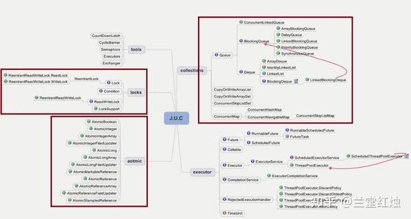
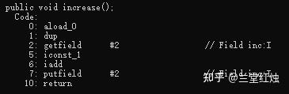
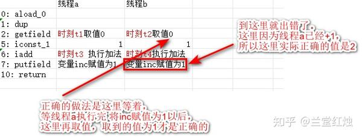
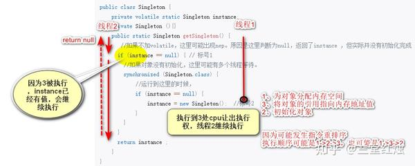
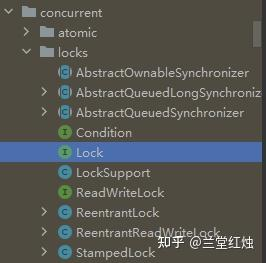
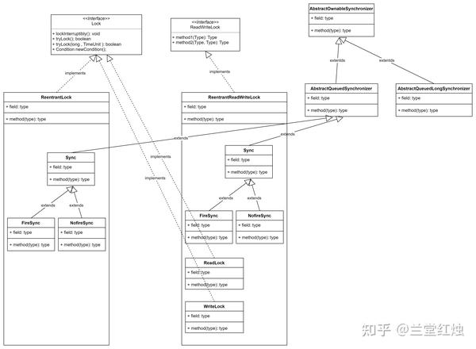
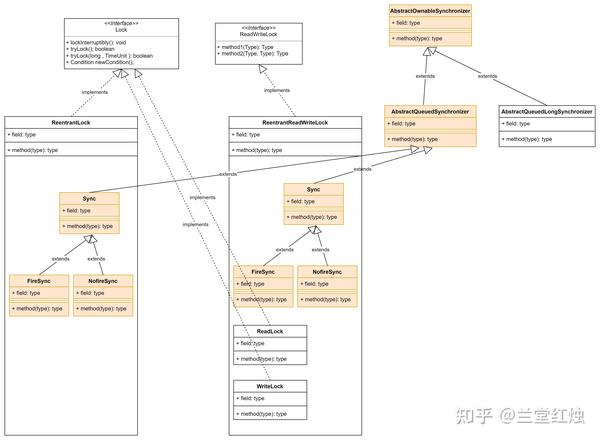

# Java中的并发体系概论

 **Author:** [兰堂红烛]

 **Link:** [https://zhuanlan.zhihu.com/p/684407108]

## 摘要  
并发的3要素是原子性，可见性，有序性。原子性是指想原子一样不可再分，可见性是指当共享变量被修改后可以立即被其他线程有效。有序性指程序代码安装编写顺序执行。java中通过volatile、synchronized和lock实现同步，来保证3要素。

volatile可以实现有序性、可见性，不能实现原子性。volatile通过禁止指令重排序实现有序性，其原理jvm字节码编译volatile为汇编指令的时候，会加上lock前缀。volatile通过内存一致性协议来实现可见性，当变量被修改会立立即由缓存同步到内存，并通知其他cpu缓存失效，其他cpu读取或者修改会读取内存中的值。对于原子性，volatile不能保证，原因是volatile用以修饰变量，但对象的赋值过程并不是原子的，对象的赋值过程分为3步骤，1是分配内存空间，2是实例化对象，3是将引用指向内存地址。其中2和3是可能发生重排序的。因为volatile不是原子性的，所以当i++这类操作，需要额外加上同步代码来修饰。

synchronized可以实现原子性，有序性和可见性。synchronized可以修饰在普通方法和静态方法上，也可以修饰代码块。当修饰代码块传入xxx.class或者修饰静态方法，使用的是类锁，当修饰代码块传入实例对象或者修饰普通方法，使用的是对象锁。synchronized的使用场景有多线程场景对代码进行同步和等待唤醒机制时和wait/notify/notifyAll配合使用。等待唤醒机制必须配合synchronized使用，否则可能notify被调用后才调用wait方法，导致一直不能被唤醒。在懒汉式单例中synchronized需要配合volatile使用，因为synchronized不能保证指令的有序性，可能会发生指令重排序。

synchronized修饰代码块的时候，使用对象头中的markhead标记，来判断是否被线程占用。修饰方法的时候，在字节码指令中通过ACC\_SYNCHRONIZED来对方法进行标记，其使用的是监视器，monitorenter和monitorexit代表进入监视器锁的加锁和解锁。

lock接口包含一个lock方法和unlock方法用以加锁和解锁。lock的子类ReentrantLock是互斥锁，ReentrantLock中包含一个同步器抽象类Sync，一个公平同步器和一个非公平同步器。ReentrantReadAndWriteLock是读写锁，读写锁包含一个读锁和一个写锁，同时包含同步器Sync和公平同步器以及非公平同步器。lock实际的加锁和解锁是通过同步器进行，也就是AQS。

AQS的原理是在AQS中包含一个同步状态state和一个CHL同步队列。加锁时，当state等于0表示同步器没有被占用。当不等于0表示被占用，**其他线程会调用Locksupport的park方法进入等待状态**，并且线程进入队列等待。AQS获取锁实现了可重入，当sate不等于0会判断是否是当前线程，如果是当前线程，会将state+1，继续执行代码，如果不是当前线程会return false进入队列尾部。所以AQS实现原理总结起来是：CAS+CHL+LockSupport

lock的非公平锁，会在lock方法被执行的时候理解尝试cas加锁，加锁失败判断state是否等于0，如果等于0直接加锁，这2个地方加锁没有判断队列中是否有线程需要执行，会产生先入队但是后执行的情况。而公平锁实现方式是判断state是否等于0，如果等于0需要判断线程前置队列是否有前置现成需要执行，队列中没有线程需要执行，才会加锁。如果不等于0就加入队列尾部。详见我的另一篇文章：[https://zhuanlan.zhihu.com/p/685053458](https://zhuanlan.zhihu.com/p/685053458)。

**synchronized使用了监视器锁而lock使用的是Locksupport。使用synchronized会给对象加偏向锁，如果有有竞争会升级为轻量级锁Lock record，轻量级使用CAS原子指令实现了锁的获取和释放，轻量级锁会自旋，当自旋超过一定次数会升级为重量级锁，重量级锁是内核态的锁，底层使用了系统级的mutex互斥锁。synchronized代码块使用了monitorenter和monitorexit指令，synchronized修饰方法则是在字节码中加入ACC\_SYNCHRONIZED修饰符，c++代码中，case(monitorenter)会走到加锁和锁升级流程。object的wait/notify/notifyall必须结合synchronized使用，否则会抛出IllegalMonitorStateException异常。**

case(monitorenter)会走到加锁和锁升级流程。其过程是取class prototype meta中的markworddec和实例对象的markoop中的markword中的锁标志位和锁状态位进行比较。当是偏向模式，可能会发生4种情况。

* 偏向自己：判断threadid+epoch，如果已经偏向当前线程，什么都不做，继续运行。
* 撤销偏向：如果偏向模式关闭了，会撤销偏向（把hashcode放回去）。
* 重偏向：如果epoch不等于class prototype中的epoch，进行重偏向：因为批量偏向策略可能导致epoch滞后
* 匿名偏向：因为偏向延迟导致的匿名不偏向任何线程的偏向，把hashcode放到prototypeheader（oopmarkdesc）中，把threadid放到oopmark中。

偏向失败有锁竞争会升级到轻量级锁。jvm会在线程的栈上显式或者隐式分配一个LockRecord.，这个LockRecord存储锁对象markword的拷贝(Displaced Mark Word)。轻量级锁自旋到一定次数以后会升级为重量级锁，重量级锁在jvm层面使用的是监视器锁，也就是ObjectMonitor，底层使用了系统层级的mutex互斥锁机制，会造成用户态到内核态的切换，成本较高。

## 一、概述：Java中的并发体系  
对于并发，首先要知道**并发的含义**，字面理解并发就是并+发。并就是同时；而发就是发起操作，这个操作可能是读、也可能是写，同时要知道的是这个操作对象是jvm堆中的共享变量。为了使其在操作共享变量时可以保证正确性，通常对写进行互斥。

另外，要知道的是**并发的三要素**。并发的三要素是指原子性、可见性、有序性。所以并发的问题就是怎么去保证原子性、可见性和有序性的问题。**①原子性**是指像原子一样不可被再分割。对于编程来讲，就是一个或多个操作要么全部执行成功要么全部执行失败，他们是不可分割的；**②可见性**是指一个线程对共享变量的修改,另一个线程能够立刻看到。这里可以反着来看，为什么不能被立即看到？原因是**cpu的多级缓存架构**，在计算机中cpu为了优化执行效率，设计了cpu缓存。cpu先操作寄存器，寄存器在同步到多级缓存，而多级缓存再同步到内存。在多核cpu中，多个缓存中的同一变量值可能不同，但内存中只有一份，当某线程修改某个全局变量以后，另一个cpu中的缓存可能还是旧值，**新修改的值可能出现2种情况，1是不一定能及时同步到内存，不能被这个cpu看到，另一个是可能已经同步到内存，但是此cpu依然访问的是自己的缓存值。**这就是可见性问题。要保证可见性，通常的方法有2种，1种是**内存一致性协议**MESI，内存一致性协议是针对多核cpu的多级缓存的协议，它保证**cpu修改了缓存中的值以后，通知其他cpu当前缓存失效。第二种是直接修改内存中的值**。③**这里要重点说一下的是有序性**。**有序性**是指程序执行的顺序按照代码的先后顺序执行。这里通常有2个层面，一个层面是语义层面的有序性，即程序按照我们编写的代码按顺序执行，这个语义是我们期望的语义顺序。另一个层面是指令层面的有序性，在计算机cpu执行指令的时候，为了优化执行效率，cpu是可能会对指令进行重排序的。对于jvm来说，有jvm指令，这哥jvm指令也是可能发生指令重排的。

**在Java中，并发三要素通过关键字volilate、synchronized和juc框架来保证**。其中**volilate** 可以保证可见性和有序性。但不能保证原子性。**synchronized**能保证原子性，可见性，对于有序性可以保证语义上的有序性，不能保证指令层面的有序性。**juc框架**主要是提供了lock系列的api，进行锁的细粒度操作。

java在此基础上java通过**juc框架提供了一系列的便捷api来简化并发开发。**包括并发集合api、线程池api、并发工具类和Atomic原子操作的api。下面我们对volilate、synchronized进行一一讲解。

  
## 二、volilate  
关于volalite保证可见性和有序性。有2个关键问题，1是怎么保证可见性和有序性的，2是volilate不能保证原子性有什么后果。

**首先说volilate是怎么保证可见性和有序性的**。

**对于可见性，volilate保证通过volilate修饰的共享变量，对不同线程的可见性，即一个线程修改了某个变量的值，这新值对其他线程来说是立即可见的**。在写变量的时候，会保证新值立即同步到主内存，读取的时候，会立即从主内存刷新。

* **强制修改主内存**。当对被 volatile 修饰的变量进行**写操作**的时候，JVM会向处理器发送一条 **LOCK 前缀**的指令，将该变量所在缓存行的数据**写回主内存**。
* **同时lock指令会出发缓存一致性协议而保证读取主内存**。 由于缓存一致性协议[#ref\_1](#ref\_1)，每个处理器通过嗅探在总线上传播的数据来检查自己的缓存是不是过期了， 当处理器发现自己缓存行对应的内存地址被修改，就会将当前处理器的缓存行置为无效状态，当处理器对这个数据进行读取或者修改操作的时候，会重新从系统内存中把数据读到处理器缓存中。

**而对于有序性，volilate则通过禁止指令重排序来实现**。使用volilate修饰的变量，禁止了cpu的质量重排序。cpu不会通过指令重拍来进行指令顺序优化。这个指令重排序包括jvm的指令重拍和cpu的指令重拍。指令重排序是JVM为了优化指令，提高程序运行效率，在不影响单线程程序执行结果的前提下，尽可能地提高并行度。Java编译器会在生成指令系列时在适当的位置会插入 内存屏障 指令来禁止处理器重排序。插入一个内存屏障，相当于告诉CPU和编译器先于这个命令的必须先执行，后于这个命令的必须后执行。对一个volatile字段进行写操作，Java内存模型将在写操作后插入一个写屏障指令，这个指令会把之前的写入值都刷新到内存。 

另一个问题是volilate不能保证原子性有什么后果。典型的就是i++自增的例子。对于代码


```
public class AtomicTest{
  static CountDownLatch count = new CountDownLatch(10);
  public volatile int inc=0;
  public static void main() throws Exception{
    final AtomicTest test = new AtomicTest();
    for(int i=0; i<10;i++){
      new Thread(()->{
        for(){
          test.increase();
        }
        System.out.println(test.inc);
      })
    }
    count.countDown();
  }
  public void increase(){
    inc++;
  }
}
```
来说，变量inc来说，**因为不能保证原子性**，所以可能出现并发问题。我们查看increase方法的字节码，如下

  
可以看到increase()被翻译为了10行指令。我们逐条分析一下


```
public void increase();
    Code:
       0: aload_0         					aload_0把this装载到了操作数栈中
       1: dup 							复制操作数栈栈顶元素，并压入栈
       2: getfield      #2                  // Field inc:I      取值
       5: iconst_1 						iconst_1 表示将整型 1 入栈
       6: iadd 							操作数栈中的前两个变量相加，并将结果压入操作数栈顶
       7: putfield      #2                  // Field inc:I
      10: return
```
  
另一个典型问题是单例的dcl(Double Checked Locking)问题。

我们知道单例模式有懒汉式和饿汉式，通常懒汉式因为有懒加载的优势而被更多采用。


```
public class Singleton {  
    private volatile static Singleton instance;  
    private Singleton (){}  
    public static Singleton getSingleton() {  
       //如果不加volatile，这里可能出现nep。原因是这里判断为null，返回了instance ，但实际并没有初始化完成
      if (instance == null) { // 标号1 
        //如果对象没有初始化，这里可能有多个线程等待。
        synchronized (Singleton.class) {  
            //运行到这里的时候，
            if (instance == null) {  
                instance = new Singleton();  //标号2
            }  
        }  
      }  
      return instance ;  
    }  
}
```
我们知道在java中instance =newSingleton()这条语句的语义是new一个对象，并给引用赋值。这个过程实际上包括3个步骤

* 为对象分配内存空间
* 初始化对象
* 将对象的内存地址值指向引用

由于jvm编译器的优化可能产生指令重排，步骤2、3可能会发生重排序，即可能出现执行顺序是1→2→3，也可能是1→3→2。当某线程运行到 标号2 处的赋值语句中时，编译器可能将指令优化为1→3→2，会先给引用赋值，这时候对象其实是null。若此时线程2运行到 标号1 处，可能会直接判断为null，并返回null，此时会出现npe。下面给出图示清晰说明

  
## 三、synchronized  
在java中提供了synchronized关键字。synchronized关键字保证了并发的3要素原子性、可见性和有序性。

前面我们已经说了**synchronized**能保证原子性，可见性，对于有序性可以保证语义上的有序性，不能保证指令层面的有序性。不能保证指令层面的有序性也即使用了synchronized修饰以后仍然是可能发生指令重排序的。同时它通过互斥实现原子性，通过内存屏障实现可见性。

synchronized的用法3种。可以修饰一个代码块自己指定锁 synchronized (this) { }，这个锁可以是实例锁如this，也可以是类锁如Xxx.class。可以修饰在一个普通方法上如 public synchronized void increase(){i++}; 这时候的锁是实例锁this。也可以修饰一个静态的方法。也可以修饰在静态方法上，修饰静态方法使用的是类锁。显而易见的是，当使用实例锁的时候，只有是同一个实例才会产生互斥，当使用类锁的时候，是以class类为锁，总所周知的是class是存在于方法区的，通常对于启动就加载的类是和jvm的生命周期相同的。所以类锁锁的范围比实例锁更大一些。

synchronized的使用场景主要有2种，一种是通过实现代码的互斥在并发时保证保证原子性，使代码类似于单核cpu一样运行，进而不需保证代码块内的有序性。另一种是在线程通信的等待唤醒机制中使用，典型的是生产者和消费者模型，消费者处于等待状态，当生产者完成生产以后通知消费者消费。需要保证的是生产者和消费者代码是互斥的，即他们使用同一个锁。示例代码如下


```
public class ThreadWaitAndNotify {
    public static Object lock = new Object();
    public static volatile int count = 0;
    static class Consumer extends Thread {
        @Override
        public void run() {
            while (true) {
                synchronized (lock) {
                    try {
                        // 共享对象wait方法，会让线程释放锁。
                        if (count == 0) {
                            lock.wait();
                        } else {
                            Thread.sleep(1000);
                            count--;
                        }
                        System.out.println("消费者消费count: " + count);
                    } catch (InterruptedException e) {
                        e.printStackTrace();
                    }
                }
            }
        }
    }
    static class Producer extends Thread {
        @Override
        public void run() {
            while (true) {
                synchronized (lock) {
                    try {
                        Thread.sleep(1000);
                    } catch (InterruptedException e) {
                        throw new RuntimeException(e);
                    }
                    count++;
                    System.out.println("生产者 生产1 ： "+count);
                    lock.notify();
                }
            }
        }
    }
    public static void main(String[] args) throws Exception {
        for (int i = 0; i < 100; i++) {
            Consumer consumer = new Consumer();
            consumer.start();
        }
        Thread.sleep(1000);
        new Producer().start();
    }
}
```
## 四、juc中的锁体系  
juc即java.util.concurrent，是java中提供的并发包，其中提供了lock锁体系。锁是并发的基础单元，锁的基础操作有加锁和解锁。

  
### 4.1 lock锁体系  
在Java中代表锁的对象是Lock接口，Lock接口提供了lock方法和unlock方法进行加锁和解锁操作。Lock接口的实现类有ReadWriteLock和ReentrantReadWriteLock中的内部类ReadLock和WriteLock。。ReadWriteLock接口见名知义是读写锁，所以它提供了readLock()和writeLock()方法来获取Lock对象，以拥有加锁和解锁的功能。ReadWriteLock的实现类是ReentrantReadWriteLock。在ReentrantReadWriteLock中定义了内部类WriteLock和ReadLock。在这个基础上还有一些其他的类一起构成了lock的锁体系，lock体系图如下

  
我们可以看到，lock体系包括了①一个lock接口以及实现类、②ReadWriteLock以及实现类还有③同步器和实现类。

### 4.2 Lock和ReentrantLock  
Lock接口是锁的顶层接口，代表了锁。ReentrantLock是Lock接口的可重入实现。

那么**①什么是可冲入锁**呢？在java中根据锁的加锁特点有偏向锁，可重入锁，自旋锁。可重入指的是，当某线程获取锁以后，在次进入同步代码块的时候，不用重新获取锁。在java中synchronized和ReentrantLock都是可重入的。

**②在ReentrantLock中，lock和unlock的加锁和解锁是通过同步器实现的**。上面我们通过体系图可以看到Sync同步器是AbstractQueuedSynchronizer的实现类。在AbstractQueuedSynchronizer中定义了释放锁的方法release()（{\color{red}{*为了文章的连贯性，我们把这个release方法的具体实现放在后面说*}}）。而加锁的方法则是在Sync中定义了抽象的lock接口，并在实现类FairSync和NonfairSync中做出了实现。

这个FairSync和NonfairSync就是**③公平锁和非公平锁**。在ReentrantLock中默认的是非公平锁


```
public ReentrantLock() {
	sync = new NonfairSync();
}
```
如果想实例化一个公平锁，则可以传入boolean类型的变量


```
public ReentrantLock(boolean fair) {
	sync = fair ? new FairSync() : new NonfairSync();
}
```
### 4.3 ReadWriteLock和ReentrantReadWriteLock  
ReadWriteLock是读写锁。在接口ReadWriteLock中定义了获取读锁和写锁的接口，他们分别是Lock readLock();和Lock writeLock();。在上面的体系图中我们可以看到，这个ReentrantReadWriteLock可以获取到Lock，Lock有lock和unlock方法。而lock和unlock方法是通过Sync同步器实现的。

相比起ReentrantLock来说，ReentrantLock的同步器通过FairSync和NonfairSync同步器进行加锁和解锁（具体来说就是lock方法调用了同步器的lock方法，unlock调用了同步器的release方法）。而ReentrantReadWriteLock的结构有所不同，ReentrantReadWriteLock包含了2个不同的Lock接口实现，一个是ReadLock，一个是WriteLock，他们和ReentrantLock是同级的。ReadLock中的lock调用了同步器的acquireShared方法，unlock调用了同步器的releaseShared方法。而WriteLock的lock方法调用的是同步器的acquire方法，unlock调用的是同步器的release方法，和ReentrantLock类似的是ReadLock和WriteLock页使用了相同的同步器。

### 4.4 同步器  
本章包含以下几部分

* 同步器体系
* **AQS和Node的结构**
* **ReentrantLock的加锁和解锁**
* **ReentrantLock的锁竞争机制**&可重入的实现。
* ReentrantReadAndWriteLock的加锁和解锁
* ReentrantReadAndWriteLock的锁竞争
* CLH的原理总结

**同步器体系**

上面讲到，在ReentrantLock和ReentrantReadWriteLock.ReadLock以及ReentrantReadWriteLock.WriteLock，{\color{red}{中加锁和解锁使用了同步一个同步器}}。我们再来温习一下juc体系中的同步器体系，我将同步器体系标注了颜色。

  
在体系图中可以看到同步器顶层的接口是AbstractOwnableSynchronizer，实现类有AbstractQueuedSynchronizer和AbstractQueuedLongSynchronizer。ReentrantLock和ReentrantReadWriteLock的内部都有AbstractQueuedSynchronizer的实现Sync。这个AbstractQueuedSynchronizer就是大名鼎鼎的基于CLH队列的AQS。

**AbstractQueuedSynchronizer和Node的结构**

在AbstractQueuedSynchronizer中定义了一个先进先出的队列，并切包含了头和尾的引用。队列的节点是内部类Node。

AQS内部队列节点类Node的定义如下


```
static final class Node {
	static final Node SHARED = new Node();
	static final Node EXCLUSIVE = null;

	static final int CANCELLED =  1;
	static final int SIGNAL    = -1;
	static final int CONDITION = -2;
	static final int PROPAGATE = -3;

	volatile int waitStatus;
	volatile Node prev;
	volatile Node next;
	volatile Thread thread;
	Node nextWaiter;
	final boolean isShared() {}
	final Node predecessor(){}
	Node() {}
	Node(Thread thread, Node mode) {}
	Node(Thread thread, int waitStatus) {}
}
```
可以看到几个关键的属性是

1. 前后节点Node prev,next
2. 等待状态int waitStatus
3. 下一个等待节点Node nextWaiter
4. 当前线程thread
5. 共享锁还是排它锁的标识SHARED 和EXCLUSIVE

而在AbstractQueuedSynchronizer中则包含了一个头结点和一个尾节点，另外还有一个同步状态。

**ReentrantLock加锁和解锁**

我们来看一下是怎么加锁和解锁的。

在ReentrantLock中定义了同步器Sync并且定义了其子类NonfairSync和FairSync。在NonfairSync中的加锁实现如下


```
final void lock() {
	if (compareAndSetState(0, 1))
		setExclusiveOwnerThread(Thread.currentThread());
	else
		acquire(1);
}
```
这个compareAndSetState是AQS中定义的方法，底层调用了unsafe类的compareAndSwapInt。compareAndSetState(0,1)的目的是将*stateOffset*从0改为1。如果修改成功，则将独占模式的所有者改为当前线程。

NonfairSync的解锁函数如下


```
public void unlock() {
        sync.release(1);
}
这个release是aqs中定义的函数，函数内容如下
public final boolean release(int arg) {
	if (tryRelease(arg)) {
		Node h = head;
		if (h != null && h.waitStatus != 0)
			unparkSuccessor(h);
		return true;
	}
	return false;
}
tryRelease是定义在同步器Sync中的
protected final boolean tryRelease(int releases) {
	int c = getState() - releases;//aqs中的state值，在ReentrantLock中，目前传的是1
	if (Thread.currentThread() != getExclusiveOwnerThread())//如果不是当前线程抛出异常
		throw new IllegalMonitorStateException();
	boolean free = false;
	if (c == 0) {//state的状态等于CANNELED
		free = true;//free 置为true，是否空闲
		setExclusiveOwnerThread(null);//没有现成执行
	}
	setState(c);
	return free;
}
```
{\color{red}{以上，我们可以知道对于非公平锁NonfairSync，加锁的过程就是就是使用cas做一个标记，而解锁就是将标记置为0。}}

**ReentrantLock的锁竞争机制&可重入原理**

而对于其他线程去竞争锁，则会走到lock方法的acquire(1)中，具体如下


```
final void lock() {
	if (compareAndSetState(0, 1))
		setExclusiveOwnerThread(Thread.currentThread());
	else
		acquire(1);
}
##################################################
public final void acquire(int arg) {
	if (!tryAcquire(arg) &&
		acquireQueued(addWaiter(Node.EXCLUSIVE), arg))
		selfInterrupt();
}
tryAcquire是定义在同步器NonfairSync中的
protected final boolean tryAcquire(int acquires) {
	return nonfairTryAcquire(acquires);
}
nonfairTryAcquire是定义在Sync中的
final boolean nonfairTryAcquire(int acquires) {
	final Thread current = Thread.currentThread();
	int c = getState();
	if (c == 0) {//没有锁，在if中加锁加锁
		if (compareAndSetState(0, acquires)) {
			setExclusiveOwnerThread(current);
			return true;
		}
	}//已经有锁了，并且是自己，就把state+1
	else if (current == getExclusiveOwnerThread()) {
		int nextc = c + acquires;
		if (nextc < 0) // overflow
			throw new Error("Maximum lock count exceeded");
		setState(nextc);
		return true;
	}
	return false;
}
```
{\color{red}{这里在acquire中，如果没有锁，会尝试加锁，如果有锁并且是自己的锁，就把state+1，从而无序在次获取锁而继续执行代码。否则就调用acquireQueued(addWaiter(Node.EXCLUSIVE), arg)加入chl队列，并且将自己的线程状态设置为interrupted，终止执行。}}

**CHI队列的运行机制**

前面我们讲到了AQS中的release的代码


```
这个release是aqs中定义的函数，函数内容如下
public final boolean release(int arg) {
	if (tryRelease(arg)) {
		Node h = head;
		if (h != null && h.waitStatus != 0)
			unparkSuccessor(h);
		return true;
	}
	return false;
}
//AQS中的unparkSuccessr方法
private void unparkSuccessor(Node node) {
	int ws = node.waitStatus;//等待状态
	if (ws < 0)
		compareAndSetWaitStatus(node, ws, 0);
	Node s = node.next;
	if (s == null || s.waitStatus > 0) {
		s = null;
                //如果s事null的， 从后往前找，找到要运行的的Node
		for (Node t = tail; t != null && t != node; t = t.prev)
			if (t.waitStatus <= 0)
				s = t;
	}
	if (s != null)
		LockSupport.unpark(s.thread);
}
```
当tryRelease运行成功以后，会将AQS的head Node拿出来，作为参数传给unparkSuccessor调用。在unparkSuccessor中，它通过LockSupport.unpark(s.thread);唤醒了下一个节点。

前面我们说到在加入队列以后，现成被调用了interrupt方法被打断，那么这个**入队列的过程**是怎么样的呢？入队列的执行是acquireQueued(addWaiter(Node.EXCLUSIVE), arg)


```
//这里加入了一个排它锁的Node
private Node addWaiter(Node mode) {
	Node node = new Node(Thread.currentThread(), mode);
	// Try the fast path of enq; backup to full enq on failure
	Node pred = tail;//尾巴
	if (pred != null) {//尾巴不等null
		node.prev = pred;//当前节点的前驱是尾巴，也就是把当前节点放在了tail后面
		if (compareAndSetTail(pred, node)) {
			pred.next = node;
			return node;
		}
	}
        //如果前面没完成,这里是入队。也是通过自旋//加载tail后面
	enq(node);
	return node;
}
final boolean acquireQueued(final Node node, int arg) {//加锁失败以后，自旋队列的头结点
	boolean failed = true;
	try {
		boolean interrupted = false;
		for (;;) {//自旋操作
			final Node p = node.predecessor();//返回当前节点的前节点
			if (p == head && tryAcquire(arg)) {//如果当前节点就是头节点，试图加锁
				setHead(node);
				p.next = null; // help GC
				failed = false;
				return interrupted;
			}
			if (shouldParkAfterFailedAcquire(p, node) &&
				parkAndCheckInterrupt())
				interrupted = true;
		}
	} finally {
		if (failed)
			cancelAcquire(node);
	}
}

```
总结一下，主要有3点。1、入队是addWrite函数实现，通过自旋进行，入队会将当前Node放在尾部。2、出队是realse函数实现。取AQS中的head进行唤醒。3、中的trhead唤醒是通过LockSupport.unpark实现。

  


收尾：本文主要是讲了Java的并发体系，以及实现Java层面的实现过程。volilate在并发中可以实现可见性和并通过禁止指令重排序实现有序性。synchronized可以实现可见性，有序性和原子性，synchronized的应用场景主要是并发控制以及配合java的唤醒等待机制。lock主要是提供了加锁和解锁的接口，具体的加锁过程是同步器AQS实现的，AQS是一个基于chL队列的可重入同步器。

对于以上的其原理部分，鉴于篇幅，会放在下文中进行说明讲解。包括volilate的底层实现，synchronized的锁升级机制以及底层实现原理。敬请期待。

  


相关阅读：

[https://zhuanlan.zhihu.com/p/685053458](https://zhuanlan.zhihu.com/p/685053458)

## 参考  
1. [#ref\_1\_0](#ref\_1\_0)缓存一致性协议 [https://blog.csdn.net/Mydf521212/article/details/106466958](https://blog.csdn.net/Mydf521212/article/details/106466958)
