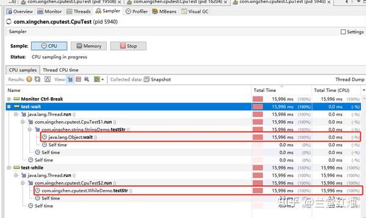
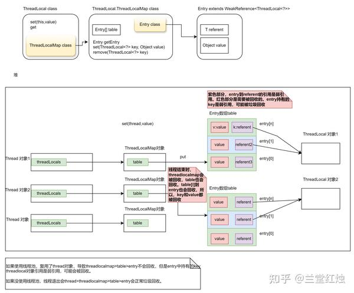
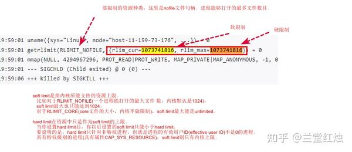

# JVM优化专题

 **Author:** [兰堂红烛]

 **Link:** [https://zhuanlan.zhihu.com/p/689792289]

## 一、Jvm常见问题  
1. 如何分析jvm cpu占用率过高的方法。
1. 死循环、full gc、磁盘io

3. 如何排查线上jvm内存泄漏问题。
1. 字符串+=、hashmap、静态集合类、缓存未清理、threadlocal等。

5. 如何定位jvm 线程死锁问题定位。
6. 如何解决jvm 频繁full gc 问题等。HotSpot虚拟机中存在三种GC现象：minor GC、major GC和full GC。
1. 堆内存：内存泄漏。
2. non-heap:metaspace超过metaspacesize。动态代理类可能会比较多，造成超过阈值。

8. 栈溢出问题：java中栈的深度和Xss2m配置有关，xss代表每个线程可使用的内存大小，即栈的大小，超过会溢出。
9. jvm元数据区泄漏问题
1. metaspacesize设置过小，原因动态代理产生大量增强class，会导致扩容，扩容会full gc。

11. oom以后线程会退出吗?
1. 所有非守护线程都OMM了，jvm在所有非守护进程退出的时候会退出：某一个线程OOM以后，这个线程会退出，但jvm不一定会退出。因为线程OOM以后，**会触发gc回收内存**。jvm在某个线程内存属于threadgroup，threadgroup继承了Thread.UncaughtExceptionHandler，在发生异常的时候会把线程名和栈打印出来，具体参见**threadgroup中的uncaughtException**方法，当然，这部分异常的**catch是在jvm层做**的，也就是c++代码中拦截。当只有一个非守护线程的时候，jvm会因为没有非守护线程运行而退出，而当所有非守护线程都OOM退出了，则jvm也会随之退出。
2. linux系统内核内存不够用，会启用OOM KILLER机制，杀死最耗内存的进程：OOM溢出，说明内存耗尽，如果操作系统内存耗尽，就会发生OOM killer(Out Of Memory killer)，干掉JVM进程，导致被动退出。

13. oom类型
1. OutOfMemoryError: GC overhead（开销） limit exceeded（溢出）：GC开销超过极限：JVM 花费超过**98% 的总时间进行 GC 并且在 GC 之后仅回收不到 2% 的堆，则**JVM 被配置为抛出此错误。
2. OutOfMemoryError: unable to create new native thread
3. OutOfMemoryError: Java heap space
4. OutOfMemoryError: Metaspace

15. jvm进程挂掉：
1. linux系统内核内存不够用，会启用OOM KILLER机制，杀死最耗内存的进程：OOM溢出，说明内存耗尽，如果操作系统内存耗尽，就会发生OOM killer(Out Of Memory killer)，干掉JVM进程，导致被动退出。可以通过dmesg命令查看，**dmesg |grep -E ‘kill|oom|out of memory**’；或者/var/log，运行egrep -i -r 'killed process' /var/log命令，获取进程id。确认和java进程down掉的时间是否吻合。/var/log/message
1. --> /var/log/dmesg — 包含内核缓冲信息（kernel ring buffer）

3. OOM KILLER 会终止内存急剧上涨威胁到系统运行的应用：比如crontab子任务被kill可能把相关的java进程杀死。

## 二、CPU高的排查  
CPU高，需要快速定位到cpu高的线程。首先top+jstack|jcmd，dump stack快照信息，*top -H -p pid | pidstat -p pid -t 1 3*定位到线程id，printf "%x\n" tid转16进制，去stack dump文件中去匹配，类似nid=0x2188这种即可找到对应线程。**生成线程快照的主要目的是定位线程出现长时间停顿的原因，如线程间死锁、死循环、请求外部的资源导致的长时间等待等**。

以下是可能发生cpu高的情况。

+ 死循环infinite loop：找出高cpu线程id，jstack dump文件中查看高cpu栈信息。
+ 递归调用：找出高cpu线程id，jstack dump文件中查看高cpu栈信息。
+ 磁盘io：定位高cpu的线程，jstack找到线程，确认是否和stream相关。

另外cpu高可能由GC线程造成。造成GC频繁原因**通常是线程不能正常结束和内存溢出**。当发生死锁，锁没释放，请求外部的资源导致的长时间等待（http、rcp超时时间没设置或者过长），可能造成阻塞的线程越来越多，占用的然后内存占用（资源本身的内存占用、资源引用的内存占用）也越来越高且无法释放，会导致不停的gc。


> GC本身不会导致cpu高，但频繁的GC会引起cpu高，另外gc引起的请求堆积也会造成cpu高。  
> 1、垃圾回收的时候会暂时挂起所有线程，然后GC会检测扫描每一个线程栈上可回收对象，然后会移动对象，并且重新设置对象指针，这整个过程首先是消耗CPU的  
> 2、 而且在这个过程之后恢复线程执行，这个时候CPU往往会引起一个高峰因为已经有更多的请求等待了  
>   
> 这种问题通常是成对儿出现的，当cpu高，很可能你的程序里可能意外的循环或者程序占用，这种通常伴随局部变量的产生，而继而就是eden区的回收，引发minor gc。而内存泄漏则会引发major gc和full gc。当发生cpu高的时候，可以观察eden、s0、s1、old、mataspace 区，堆外内存的当前量和变化情况。

* 死锁：jstack dump文件中找 **waiting to lock，deadlockd**。死锁不会直接导致 CPU 资源占用过高，但是由于死锁，阻塞的线程越来越多，然后内存占用也越来越高且无法释放，导致不停的 gc
* 锁资源没释放导致死锁：未在finnaly块中释放锁。这种死锁最可怕的地方是难以排查，使用jstack时无法分析出这一类的死锁，你大概能得到的反馈可能**线程仍然处于RUNNABLE。这种直接上**静态分析工具findbugs。pdm
* 请求外部的资源导致的长时间等待：未设置超时时间，请求量一大多，吞吐量降低。导致内存升高。


```
public void locktest(int i) {
  LOCK.lock();
  if (i == 5) {
    throw new IllegalArgumentException();
  }
  LOCK.unlock();
}
```
本地调试可以使用visualvm，机器上可以使用arthas。上图是visulavm的cpu抽样图，可以看到while循环的执行时间比total time(cpu)/total time 较高的就是耗cpu高的。

  
## 三、内存泄漏的情况  
可能的原因（无法释放已申请的内存空间）：while+字符串拼接+资源没释放，threadlocal，集合、map引用

* **字符拼接**（可回收，但会增加gc频率）：
+ 在while循环中，不要使用substring,replace,contact：string是不可变对象，string的都会新城一个string对象，所以不要使用；不要使用+=：反编译可以看到，这种方法每次循环都会 new 出一个 StringBuilder 对象。**这些方法+while循环**会造成eden区不断进行回收。正确的方法是使用stringbuilder，stringjoiner，string.join方法，String.format，MessageFormat等。

* **threadlocal**：ThreadLocal会造成内存泄漏，会了避免内存泄漏，使用了弱引用，但是在使用线程池的时候，因为entry的key会被回收，但value被entry引用而不会回收，可能出现内存泄漏。弱引用可能带来**数据丢失，可以使用静态单例声明threadlocal来避免。*这里要注意弱可达对象的回收*。**
* **hashmap**导致内存泄漏：
+ hashcode：hashmap中的key，使用hashCode()定位，如果对象作为key，对象中的数下变化可能引起hashcode值的变化，导致hashcode不一致而无法获取到值。这写无法获取到的值，会因为hashmap持有而无法被gc回收，导致内存溢出。**【不回收】**
+ equal：另一种情况是hashcode方法被重写而equal方法没重写导致，当hashcode相同的时候，被hash到一个桶中，但是equal比较的时候不相等，而一直添加。**【添加过多+不回收】**

* **静态集合：**如静态`List`、`Map`或`Set`，可以在整个应用程序生命周期内保留对象引用。如果您向静态集合中添加对象，并且不再需要这些对象，它们将永远不会被垃圾回收。解决方法：使用弱引用或软引用来管理静态集合中的对象引用，或者确保在不再需要对象时从静态集合中删除它们。
* **匿名内部类**：匿名内部类通常会隐式地持有对外部类的引用，这可能导致外部类的对象无法被垃圾回收
* **缓存未清理**：对象被存储在缓存中，但没有过期或被删除，导致缓存中的对象持续增加。

对于内存泄漏，会导致内存紧张而持续发生GC，导致cpu高，可以使用**-XX:+HeapDumpOnOutOfMemoryError参数在发生oom的时候dump堆内存。使用mat、jprofile、virtualVM工具进行分析。另外当机器卡死可以使用系统自带工具如pscore、coredump进行dump内存。当jmap无响应使用jmap -F 进行强制dump。**

  


## 四、java进程被kill  
**oom-killer**

**五、jvm优化**

**优化的指标：吞吐量、停顿时间、垃圾回收频率**

  


## 附1：关于ThreadLocal内存泄漏问题的图示  
  
  


## 附2：网上的一些案例  
### 1、java进程被kill  
[https://zhuanlan.zhihu.com/p/663223279](https://zhuanlan.zhihu.com/p/663223279) ：crontab


> **问题原因：** docker里有一个/etc/crontab任务——cd 到目录/nginx/sbin执行/logrotate.sh（看名字目测是用来切分nginx日志的，不知道作者把这个给停掉，会不会有其他问题 ）。Java 被 kill 的同时 crond 也被 kill 了，被 kill 的原因是 crond 内存过高导致 oom连带把容器中的java给杀死了&**amp;lt;br/>解决：**strace ./logrotate.sh 命令查看进程执行信息（strace是跟踪进程执行时的系统调用和所接收的信号（即它跟踪到一个进程产生的系统调用，包括参数、返回值、执行消耗的时间））**。**&**lt;br/>分析：这里crond脚本走到getrlimit——>mmap——>sigchld child exited （这个sigchld是收到子进程退出的信号）&**amp;amp;lt;br/>getrlimit是一个函数，用于控制系统资源的最大使用量，如核心文件、CPU时间、数据段、文件、栈等**&**[https://pubs.opengroup.org/onlinepubs/9699919799/basedefs/sys\_resource.h.html](https://pubs.opengroup.org/onlinepubs/9699919799/basedefs/sys\_resource.h.html) getrlimit文档&[https://github.com/cronie-crond/cronie/blob/master/src/popen.c#L58](https://github.com/cronie-crond/cronie/blob/master/src/popen.c#L58) crond源码&[https://www.man7.org/linux/man-pages/man2/getdtablesize.2.html](https://www.man7.org/linux/man-pages/man2/getdtablesize.2.html) getdtable手册

  
  


### 2、full gc  
[https://www.jianshu.com/p/6ec7c253901f](https://www.jianshu.com/p/6ec7c253901f) : metaspace配置过小，导致频繁扩容，扩容时候会fullgc。

### 3、cpu高  
  
[https://blog.csdn.net/hotthought/article/details/82987428](https://blog.csdn.net/hotthought/article/details/82987428) ：连接未设置超时时间+**while循环+string+=造成**，这个作者本身没搞清楚问题本质。  
[https://zhuanlan.zhihu.com/p/213933770](https://zhuanlan.zhihu.com/p/213933770)：**队列take阻塞导致cpu**高，使用arthas的watch和trace命令查看具体的异常信息和方法调用栈中每个方法的执行时长。

### 4、oom  
  
[https://zhuanlan.zhihu.com/p/432258798](https://zhuanlan.zhihu.com/p/432258798) ：升级jdk1.8导致元数据区泄漏。**fastjson的SerializeConfig实例化的姿势错误**，不能每次buildData的时候区new一个config，要保持config单例状态。这个比较有意思。  
[https://blog.csdn.net/hgq0916/article/details/123882912](https://blog.csdn.net/hgq0916/article/details/123882912)：参数传空map，导致全部数据加载到内存了，然后服务就直接OOM了。


> 作者文章中有几个错误：1、classloader回收的问题2、maxmetaspacesize值的问题。  
>   
> 1.7和1.8的区别：[https://zhuanlan.zhihu.com/p/111809384](https://zhuanlan.zhihu.com/p/111809384)  
> 1.8和1.7升级，方法区取消，替代的是metaspace，metaspace默认无限大？？可能无限扩张？？。一般机器上都有个默认值，java -XX:+PrintFlagsInitial可以查看。[https://github.com/Snailclimb/JavaGuide/issues/1204](https://github.com/Snailclimb/JavaGuide/issues/1204)  
>   
> 区别：取消方法区，方法区中的元数据区和字符串常量池，其中元数据区移动到metaspace，字符串常量池移动到堆中。之前元数据区作为永久代和老年代相连，堆做full gc的时候会回收。现在在metaspace达到metaspacesize值以后会full gc。metaspace实际占用的空间可能升高或者降低。作者出现问题的原因可能单纯就是机器内存太小才4g。  
>   
> 前提：垃圾回收机制：**字节码增强会生成很多代理字节码，用以实例化对象。**代理类被垃圾回收,代理类的类加载器也会被垃圾回收。  
>   
> 1.7以下  
> 通过 -XX:PermSize 来设置永久代初始分配空间。默认值是20.75M。  
> 通过 -XX:MaxPermSize 来设定永久代最大可分配空间。32位机器默认是 64M，64位机器模式是 82M。  
> 会和堆一起gc，超过最大值会报oom：Java.lang.OutOfMemoryError: PermGen Space。堆空间超过报：java.lang.OutOfMemoryError: Java heap space  
>    
> 在Java 8及以后的版本中，元空间的JVM参数有两个：-XX:MetaspaceSize=N和-XX:MaxMetaspaceSize=N。对于64位JVM来说，元空间的默认初始大小是20.75MB，而默认的元空间的最大值是无限的。建议将MetaspaceSize和MaxMetaspaceSize设置为相同的值，对于大部分项目256m即可。MetaspaceSize的值设置的过大会延长垃圾回收时间，而MaxMetaspaceSize是分配给类元数据空间的最大值，此值默认没有限制，但实际系统不同，可能是有的。超过MetaspaceSize就会触发Full GC，但应取决于系统内存的大小。  
>   
> metaspace的触发gc的时机和扩容有关。  
> 现象：non-heap在启动后呈快速上涨的态势，也就是说在不断的扩容。而metaspace的扩容会触发full gc。  
> - metaspacesize  
> - 高水位线设置有关Max/MinMetaspaceFreeRatio。  
> 解决方法，将MetaspaceSize和MaxMetaspaceSize设置为相同的值，避免其频繁扩容。  
>   
> Metaspace 区域位于堆外，所以它的最大内存大小取决于系统内存，而不是堆大小，我们可以指定 MaxMetaspaceSize 参数来限定它的最大内存，避免堆。

  


### 5、swap导致gc停顿  
[https://zhuanlan.zhihu.com/p/697618646](https://zhuanlan.zhihu.com/p/697618646)

## 附4：引申问题：  
1、如何dump出内存中的数据，分析和查找对象的内容。

2、ThreadLocal弱引用带来的数据丢失


> [https://cloud.tencent.com/developer/article/1563309](https://cloud.tencent.com/developer/article/1563309)：使用static单例持有对象使其不被回收。  
> [https://www.zhihu.com/question/464202883/answer/2631155404](https://www.zhihu.com/question/464202883/answer/2631155404)：get()方法会清理value和entry[hashCode(threadlocal)]

3、弱可达对象的回收过程。

4、阿尔萨斯工具的运用

## 附5：JVM相关命令  
元数据区排查：思路：non-heap、元数据区初始有多大、实际占用了多少，元空间中加载了哪些类分别占用了多少。GC日志查看一下回收情况。

查看加载了**哪些类**：  
 - java -verbose:class 8716  
 - jstat -class pid:显示加载class的数量，及**所占空间**等信息  
查看元数据区**默认大小**：java -XX:+PrintFlagsInitial|grep Metaspace  
metaspace**使用量**，可以通过jstat 命令查看：  
关注这么几个指标：MC:方法区大小 MU:方法区使用大小 CCSC:压缩类空间大小 CCSU:压缩类空间使用大小。

* GC信息：
+ **垃圾回收统计：**jstat -gc 8716  
**堆内存容量统计：**jstat -gccapacity 8716  
**新生代垃圾回收统计：**jstat -gcnew 8716  
**新生代内存容量统计：**jstat -gcnewcapacity 8716  
**老年代垃圾回收统计:** jstat -gcold 8716  
**老年代内存统计:** jstat -gcoldcapacity 8716  
元空间容量：jstat -gcmetacapacity 8716  
**总结垃圾回收统计:**jstat -gcutil 8716

* perf：Linux自带性能分析工具，基于事件采样原理，以性能事件为基础，支持针对处理器相关性能指标与操作系统相关性能指标的性能剖析。[https://zhuanlan.zhihu.com/p/149971893](https://zhuanlan.zhihu.com/p/149971893)

查看GC日志：[https://www.cnblogs.com/klvchen/articles/11841337.html](https://www.cnblogs.com/klvchen/articles/11841337.html)

  


  


死锁实验：[https://github.com/kabutz/DeadlockLabJavaOne2012/](https://github.com/kabutz/DeadlockLabJavaOne2012/)

