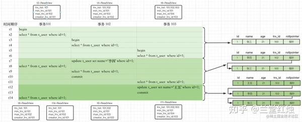
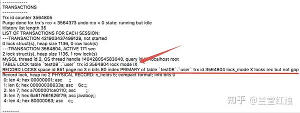
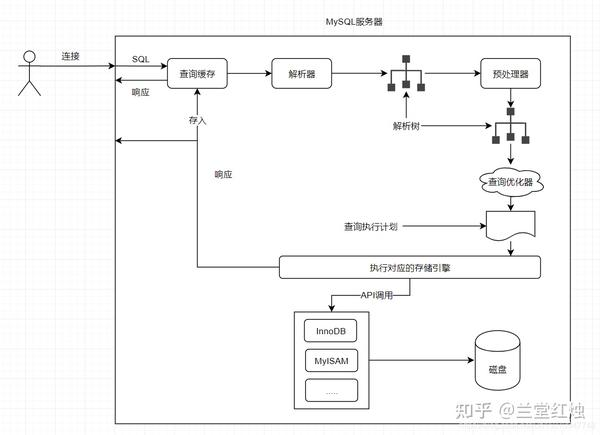

# mysql的必知必会（简介）

 **Author:** [兰堂红烛]

 **Link:** [https://zhuanlan.zhihu.com/p/689571494]

## 契子  
对于mysql的原理和源码分析，之前写过文章，但是篇幅过长，不利于阅读。这里做一下简单的全局性介绍。


> mysql的原理和源码分析参见 [https://zhuanlan.zhihu.com/p/675084748](https://zhuanlan.zhihu.com/p/675084748)

## 概述  
mysql是最常用的免费强一致性非关系型数据库。mysql提供了多种存储引擎，常用的有innodb、myisam、myisam merge、memory、archive、full text。其中最常用的是innodb，innodb支持行级事务，允许高并发的读写操作、支持mvcc、，而myisam不支持事务、不支持外键，适合读多写少的场景。

## mvcc 原理  
mvcc是mysql的并发控制机制。首先要了解的是，**事务的特性**主要是acid：原子性、隔离性、一致性、持久性。产生事务问题的本质原因是多个事务之间的不隔离性导致其数据互相干扰，所以要保证原子性和持久性，一致性是事务隔离的后果。不保证隔离性会出现**4个级别的并发问题**：脏读（读到了其他事务未提交的数据）、不可重复度（本次事务两次读到的数据数据不一致，其他事务进行了update操作）、可重复度（再一次事务种读取到的数据不出现不一致的情况）、幻读（事务中开始没读到，但是后来又读到了insert或者开始读到了，后来又被删除了delete）。mysql支持了对应的**4种隔离级别**来解决这些问题，分别是：读未提交（ru）、读提交 （rc）可重复读 （rr）串行化 （SERIALIZABLE）。**针对读+读的不同事务，不需要解决；针对读+写的不同事务，mvcc使用读试图实现了在读的时候写不会对读产生影响，即非阻塞并发读；针对写+写的操作，需要加锁实现**。

那么mvcc是如何实现非阻塞并发读的呢?mvcc通过**版本链+读视图**实现。在mysql中分**当前读和快照读**，当前读是读取数据本身，在读取时对当前数据行进行加锁，例如`select …… lock in share mode（共享锁）`、`select …… for update | insert | delete（排他锁）`；**快照读**：当修改记录的时候，会在undo log中记录行的快照，多次修改会产生一个版本链，读取undolog版本链即快照即为快照读。。mvcc在**rc和rr下生成读视图的策略**是不同的，**在rc下**，每次select都会生成一个读视图，也就是当发生快照读以后，而**在rr下**，只在第一次快照读的时候生成读视图。

在mysql的row记录中，存储了**几个隐藏的字段row\_id、trx\_id、roll\_pointer**。每次修改的时候会记录redolog和undolog，redolog用于数据恢复，undolog用于事务回滚和mvcc。修改数据会生成一次**undolog记录**，再次修改以后会再次生成一条undolog记录，新的这条记录的roll\_pointer指向上一条undolog的位置，这样就有这条数据的**多个快照版本，形成版本链**。可以想到的是，在一个事务中读取一个记录，如果本事务的trx\_id和undolog链中的trx\_id相等，说明是本事务修改的，可以读取该版本链中的值。其他版本是否可以读取和版本链以及读视图有关。

  


rr级别下的readview（图片出处见水印）

  
  
在mvcc的Read view中，记录了活动事务列表m\_ids，m\_ids中最小的id：min\_trx\_id，下一个事务id max\_trx\_id和当前事务id creator\_trx\_id。

* 对于之前已经存在并且未提交的事务，显然是不能读取的，也就是trx\_id<当前事务id的不能读取。比如版本链中有1，2，3，处于活动状态的有23，又开启了事务4，然后又有了1个事务5，则因为1<2固1可以读取。
* 如果当前事务id是4，所以版本链中trx\_id=4的记录可以读取。
* 那么需要思考的就是：开启事务4以后，又开启的5，并且在5中，4提交了的情况。
+ rc：不可重复读。5中读取到的可能不同。所以当4提交以后，5可以读取到。
+ rr：可重复读。5中读取到的不能不同，所以当4提交以后，5不可读到。
+ 在rc中，每次select都会生成一个readview，所以，在5中多次读取使用到的快照是不同的，所以读到的值也不同，而在rr中，第一次快照读以后，事务公用一个快照，所以读取到的快照版本是一样的。
+ 算法：trx\_id>max\_trx\_id当前事务不可以见，在rc中，每次都生成1个快照，所以5中，

当前事务id trx\_id 不在m\_ids中，可以读取版本链中最大的值，也就是最新值。

当前事务id在m\_ids中，可以读取当前事务的值

在RC隔离级别下，每一次快照读都会生成一个最新的ReadView；在RR隔离级别下，只有事务中第一次快照读会生成ReadView，之后的快照读都使用第一次生成的ReadView

## mysql中的锁  
**我们知道锁分为共享锁(s锁，读锁)和排它锁（x锁，写锁），在mysql这两种锁针对的是数据的读取，也就是select。为select语句加共享的语句是select x from t where id=1 lock in share mode。而加排它锁使用语句select x from t where id=1 for update|delete|insert 。对表加s锁的语句是**lock table t1read ; 加x锁是lock table t1write，锁表以后可以进行其他操作。

共享锁在锁定期间，所有事务（包括本事务）都不能对该资源进行UPDATE DELETE等操作（即无法加上排他锁），直到锁定结束，对于查询同一资源的不同事务，都可以对该资源加上共享锁（共享锁可以同时加上多个）。排他锁又称为写锁，简称X锁，排它锁不能与其它锁并存，而且只有一个事务能拿到某一数据行的排它锁，其余事务不能再获取该数据行的所有锁。

在mysql还存在存在**意向锁**，分为**意向共享锁**(IS锁)和**意向排他锁**(IX锁)，意向锁通常仅仅指的是表锁。一个事务在获取（任何一行/或者全表）S锁之前，一定会先在所在的表上加IS锁。一个事务在获取（任何一行/或者全表）X锁之前，一定会先在所在的表上加IX锁。意向锁可以在某些大范围操作时，对范围内数据使用行锁导致性能下降，例如若修改表结构，我们假设一个场景，一个事务A正在写某个表T的第r行加了写锁，另一个事务B尝试去对整个表做操作（例如修改表结构的时候），B尝试去对整个表加一个写锁。则此时，需要执行两个步骤：1）检查表T是否被上了读锁或者写锁。2）遍历所有行，查看每一行是否被上了读锁或写锁。意向锁直接锁表效率更高。

从**锁定范围分**，mysql的锁可分为**表级锁、行级锁、页级锁。而行级锁分为记录锁、间隙锁、邻键锁，行锁都是排它锁**。MyISAM 和 Memory 采用表级锁（table-level locking），BDB 采用页级锁（page-level locking）或表级锁，默认为页级锁；InnoDB 支持行级锁（row-level locking）和表级锁，默认为行级锁。

* 记录锁：记录锁也成为行锁，但是锁的实现，不是锁的数据记录数据，而是锁的索引项。
* 间隙锁：间隙锁是为了解决幻读问题。因为行锁只能锁住行，但是新插入记录这个动作，要更新的是记录之间的“间隙”。为了解决幻读问题，InnoDB 引入了间隙锁 (Gap Lock)。间隙锁，锁的就是两个值之间的空隙，不允许两个值之间再插一个值。比如初始化插入了 6 个记录，这就产生了 7 个间隙。分别是 (-∞,0)、(0,5)、(5,10)、(10,15)、(15,20)、(20, 25)、(25, +supremum)，间隙锁都是开区间
* 邻键锁：间隙锁和行锁合称 next-key lock，每个 next-key lock 是前开后闭区间。如果用 select \* from t for update 要把整个表所有记录锁起来，就形成了 7 个 next-key lock，分别是 (-∞,0]、(0,5]、(5,10]、(10,15]、(15,20]、(20, 25]、(25, +supremum]。和间隙锁的最大区别是，next-key lock 为前开后闭区间，这样所有的next-key lock就可以把所有记录锁起来。

## mysql死锁  
mysql死锁的产生和预防

todo

死锁的排查和解决

1、show engine innodb status：发生死锁异常后，我们可以直接使用 `show engine innodb status` 命令获取死锁信息，但是该命令只能获取最近一次的死锁信息。

  
2、set GLOBAL innodb\_status\_output\_locks=ON; 我们可以通过开启 InnoDB 的监控机制来获取实时的死锁信息，它会周期性（每隔 15 秒）打印 InnoDb 的运行状态到 mysqld 服务的错误日志文件中。

InnoDb 的监控较为重要的有标准监控（Standard InnoDB Monitor）和 锁监控（InnoDB Lock Monitor），通过对应的系统参数可以将其开启。


```
-- 开启标准监控
set GLOBAL innodb_status_output=ON;
-- 关闭标准监控
set GLOBAL innodb_status_output=OFF;
-- 开启锁监控
set GLOBAL innodb_status_output_locks=ON;
-- 关闭锁监控
set GLOBAL innodb_status_output_locks=OFF;
```
3、set GLOBAL innodb\_print\_all\_deadlocks=ON;。MySQL 提供了一个系统参数 `innodb_print_all_deadlocks` 专门用于记录死锁日志，当发生死锁时，死锁日志会记录到 MySQL 的错误日志文件中。


```
set GLOBAL innodb_print_all_deadlocks=ON;

```
## mysql中的sql优化  
可能不走索引的情况

1. mysql优化器的选择
1. 统计信息不准确，导致sql优化器优化错误。
2. 记录较少
3. 匹配记录超过25%：> < between and

3. sql问题
1. 没有对应的索引可用
1. 使用函数（数字函数、字符串函数、日期函数DATEDIFF、其他高级函数IF判断等）：无法使用索引，可能造成结果多
2. 使用了运算符（+-x÷运算）

3. 有索引但是不可用
1. 隐式转换：
2. 联合索引不满足最左匹配原则

5. where条件导致数据无法精确定位
1. like：全通配和前统配
2. 不等值查询：<> !=
3. null值查询：is null ,is not null
4. **in 可能不走索引：in条件过多。**not in：一定不走索引。
5. not exist：
6. **or 查询可能不走索引：** 如果条件中有or，只要其中一个条件没有索引 ，其他字段有索引也不会使用。 如果一个字段没有索引，那么就会造成 全表扫描 + 索引扫描 + 结果聚合；因此效率不如直接全表扫描；dbms 会直接放弃索引；优化手段：**UNION替换OR。或者in。**

## mysql中的索引优化  
聚簇索引、索引覆盖、索引下推

聚簇索引：MySQL的InnoDB索引数据结构是B+树，主键索引叶子节点的值存储的就是MySQL的数据行，普通索引的叶子节点的值存储的是主键值。**聚簇索引：**找到了索引就找到了需要的数据，那么这个索引就是聚簇索引，所以主键就是聚簇索引，修改聚簇索引其实就是修改主键。**非聚簇索引（回表、二级索引、辅助索引）**：索引的存储和数据的存储是分离的，也就是说找到了索引但没找到数据，需要根据索引上的值(主键)再次**回表查询**,非聚簇索引也叫做辅助索引。

索引覆盖：

索引下推：Using index condition。索引下推的目的是为了减少回表次数，也就是要减少IO操作。对于InnoDB的**聚簇索引**来说，数据和索引是在一起的，不存在回表这一说。

索引下推使用条件

* 只能用于`range`、 `ref`、 `eq_ref`、`ref_or_null`访问方法；
* 只能用于`InnoDB`和 `MyISAM`存储引擎及其分区表；
* 对`InnoDB`存储引擎来说，索引下推只适用于二级索引（也叫辅助索引）;
* 引用了子查询的条件不能下推；
* 引用了存储函数的条件不能下推，因为存储引擎无法调用存储函数。

索引树是如何维护的？

首先mysql是b+树，可能有多层。然后使用的是聚簇索引。

创建库，有idb和idata，会创建一个空文件。默认是

## mysql架构  
* 连接层：连接池
* 服务层：sql api、sql解析、sql优化器、缓存：sql缓存、全局缓存，引擎缓存
* 引擎层：innodb、myisam
* 文件存储：redo undo bin log / ibd,idata/

  


innodb 

  


## mysql qps tps统计  

```
mysql qps tps一般多大

(1)QPS(每秒Query量) 
QPS = Questions(or Queries) / seconds 
mysql > show  global  status like 'Question%'; 
 
(2)TPS(每秒事务量) 
TPS = (Com_commit + Com_rollback) / seconds 
mysql > show global status like 'Com_commit'; 
mysql > show global status like 'Com_rollback'; 
 
(3)key Buffer 命中率 
mysql>show  global   status  like   'key%'; 
key_buffer_read_hits = (1-key_reads / key_read_requests) * 100% 
key_buffer_write_hits = (1-key_writes / key_write_requests) * 100% 
 
(4)InnoDB Buffer命中率 
mysql> show status like 'innodb_buffer_pool_read%'; 
innodb_buffer_read_hits = (1 - innodb_buffer_pool_reads / innodb_buffer_pool_read_requests) * 100% 
 
(5)Query Cache命中率 
mysql> show status like 'Qcache%'; 
Query_cache_hits = (Qcahce_hits / (Qcache_hits + Qcache_inserts )) * 100%; 
 
(6)Table Cache状态量 
mysql> show global  status like 'open%'; 
比较 open_tables  与 opend_tables 值 
 
(7)Thread Cache 命中率 
mysql> show global status like 'Thread%'; 
mysql> show global status like 'Connections'; 
Thread_cache_hits = (1 - Threads_created / connections ) * 100% 
 
(8)锁定状态 
mysql> show global  status like '%lock%'; 
Table_locks_waited/Table_locks_immediate=0.3%  如果这个比值比较大的话，说明表锁造成的阻塞比较严重 
Innodb_row_lock_waits innodb行锁，太大可能是间隙锁造成的 
 
(9)复制延时量 
mysql > show slave status 
查看延时时间 
 
(10) Tmp Table 状况(临时表状况) 
mysql > show status like 'Create_tmp%'; 
Created_tmp_disk_tables/Created_tmp_tables比值最好不要超过10%，如果Created_tmp_tables值比较大， 
可能是排序句子过多或者是连接句子不够优化 
 
(11) Binlog Cache 使用状况 
mysql > show status like 'Binlog_cache%'; 
如果Binlog_cache_disk_use值不为0 ，可能需要调大 binlog_cache_size大小 
 
(12) Innodb_log_waits 量 
mysql > show status like 'innodb_log_waits'; 
Innodb_log_waits值不等于0的话，表明 innodb log  buffer 因为空间不足而等待 
 
比如命令： 
>#show global status; 
虽然可以使用： 
>#show global status like %...%; 
```
## mysql中的缓存  
binlog cache:

查询缓存：当开启查询以后，当命中缓存以后，mysql不会走sql接口>sql解析>sql优化器>执行引擎这样的流程，会直接根据sql到查询结果的缓存返回数据。

  
mysql的查询缓存是以keyvalue的方式存储的，key是mysql的文本。可以在配置文件my.conf中开启查询缓存query\_cache\_type=1。同时可以配置查询缓存的大小query\_cache\_size。

表中数据的改变或者表结构的改变，会导致查询缓存失效。

查询缓存的缺点是缓存失效频繁、会占用mysql的内存。

需要注意的是，查询缓存在**MySQL5.7.20 版本已过时，在 MySQL8.0 版本中被移除。**

## binlog & redolog  
**redolog 和binlog简介**

**binlog是归档日志，记录所有数据库表结构变更以及表数据修改的二进制日志，记录的是原始的sql语句。**binlog的几个点是要知道的**。1\_binlog**)我们知道mysql在事务提交时，会记录**binlog（只记录写入性操作**），binlog是**二进制**的形式保存磁盘。**2\_刷盘时机**）mysql通中有一个参数叫***sync\_binlog***，用以控制binlog的刷盘时机。0表示系统判断刷盘时机，1表示每次事务commit强制刷盘，n表示n个事务才写入磁盘。**3\_binlog\_cache)**bin log 有对应的bin log缓存，在内存中保存binlog数据，通过**binlog\_cache\_size控制缓存大小，当binlog\_cache不足**时，写入临时文件**。4\_binlog\_cache临时文件) 当binlog\_cache不足时**，写入磁盘**，**可以通过**max\_binlog\_cache\_size**设置大小,cache临时文件超过后，会报出异常ERROR 1197。5\_)**binlog清空策略**：binlog写入临时文件以后会清空，commit以后，对应的event会清除。**6)\_binlog格式）**binlog日志有三种格式，分别为STATMENT、ROW和MIXED。

redolog会记录语句对具体页的哪个位置做了哪些修改操作，有几个点要知道。**1\_固定大小)**redolog的大小是固定是，redolog可以设置分组，比如1组4个，然后循环写入。**2\_write pos 和 checkpoint)**write pos 和 checkpoint 之间的记录空闲部分，可以用来记录新的操作。如果 write pos 追上 checkpoint，表示空间满了，这时候不能再执行新的更新，得停下*来先擦掉一些记录，把 checkpoint 推进一下。*3\_顺序写)索引数据按page加载到内存中，修改后需要按page写到磁盘，但是每次可能只是改了page中的一小部分，整个page刷入磁盘，非常浪费IO性能，redolog是为了解决这个问题。**3\_redolog buffer)** redologbuffer是mysql启动时候在系统申请的一块连续内存，在redologbuffer中分了若干个block，一个block的大小是512kb，block中可以存储redo log 记录，每一个redo log几个字节到几十个字节。redolog buffer默认大小是16M，可以通过设置MySQL的innodb\_log\_buffer\_size可以指定这个redo log buffer的大小。4\_写磁盘时机)超过buffer的一半时候必然会写盘，commit时候会写盘，mysql关闭时候会写盘。**5\_）刷盘时机innodb\_flush\_log\_at\_trx\_commit：**注意redo log写入磁盘文件，是先进入 os cache的，进入 os的文件缓冲区里（cpu缓存，oscache），所以是否提交事务就强行把 redo log刷入物理磁盘文件中，这个需要设置对应的参数innodb\_flush\_log\_at\_trx\_commit。

**redolog刷盘时机：innodb\_flush\_log\_at\_trx\_commit参数此参数控制**控制写盘时机

+ 0（延迟写，1s延迟）：提交事务时不会将redo log写入os buffer（延迟写），而是每隔1秒将redo log写入os buffer并调用fsync()刷入磁盘。系统崩溃会丢失一秒钟的数据。即：1s写+刷。
+ 1（实时写，实时刷）：实时写，实时刷。每次提交事务都将redo log写入os buffer并调用fsync()刷入磁盘。这种方式系统奔溃不会丢失数据，因每次提交事务都写入磁盘，性能比较差（推荐）。即：每次写+刷。
+ 2（实时写延迟刷）：实时写，延时刷。每次提交事务都将redo log写入os buffer，但并不会马上调用fsync()刷如磁盘，而是间隔1秒调fsync()刷盘。相对于每次提交都写盘和每隔1秒写盘，实施写os buffer延时刷盘是一个数据一致性与性能的之间的这种方案。即：每次写+1s刷。

## mysql二次提交  
**假设一：先写redo log再写binlog**  
想象一下，如果数据库系统在写完一个事务的redo log时发生crash，而此时这个事务的binlog还没有持久化。在数据库恢复后，主库会根据redo log中去完成此事务的重做，主库中就有这个事务的数据。但是，由于此事务并没有产生binlog，即使主库恢复后，关于此事务的数据修改也不会同步到从库上，这样就产生了`主从不一致`的错误。

**假设二：先写binlog再写redo log**  
想象一下，如果数据库系统在写完一个事务的binlog时发生crash，而此时这个事务的redo log还没有持久化，或者说此事务的redo log还没记录完（至少没有记录commit log）。在数据库恢复后，`从库`会根据主库中记录的binlog去回放此事务的数据修改。但是，由于此事务并没有产生完整提交的redo log，主库在恢复后会回滚该事务，这样也会产生主从不一致的错误。

通过上面的假设和分析，我们可以看出，`不管是先写redo log还是先写binlog，都有可能会产生主从不一致的错误`，那么MySQL又是怎么做到binlog和redo log的一致性的呢？

  


  


  


过程：redolog（prepare）——>写binlog——>redolog（commit）更新内存。

redolog在内存中有缓冲区redo log buffer，在更新时会先写binlog chache，再写redolog buffer。

binlog和redolog都会写事务文件，redolog会循环写入。但是持久化磁盘的时候，先此就会

## mysql常见问题  
