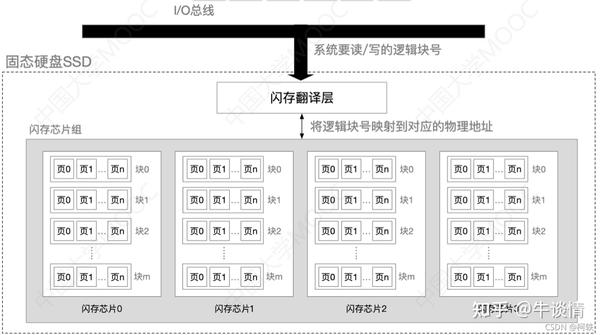
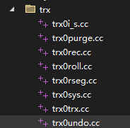

# mysql论道

 **Author:** [兰堂红烛]

 **Link:** [https://zhuanlan.zhihu.com/p/675084748]

## 1、引子  
### 1.1 关系型数据库  
关键词：集合论、关系模型、关系代数、二维表、kv、

什么是关系型数据库？首先需要理解的是关系型。要知道什么是关系型，就要知道什么是关系。

在语言上来讲，关系的这个关，是指的相关，而这个关，是有界限的意思，有关，无关，鬼门关，山海关，说的是能不能放一块，更进一步说，可能是有接触的，比如关联，没有断，并且联到一起了就叫关联。这个系是联系，也是可以绑在一起说的意思。所以说**语言学上来说这个关系是指有连系，可以顺着一个找到另一个**。我们常说我和这件事情没有关系，关系也可以加修饰词，比如性关系，父子关系，使用关系，朋友关系。这个前缀修饰了关系的类型，可能是人和人之间的，人和物之间的，或者说就是事务之间的，来说明事务之间关联的类型。

那关系型是什么呢？是关系这种类型的，关系的话，包含的主要是关系代数和关系模型。先来说关系代数。**数据库科学里的这个关系是借了数学领域的集合论中的概念，集合论的研究领域是集合、元素和成员关系，**而**关系代数**则是关系型数据库理论的基础。关系代数以数据对象的表示和操作为核心，来描述集合和集合之间的关系以及集合于元素之间的关系。集合和集合之间的关系，包括相交、相合、相异，也就是交集，并集，差集，另外还有笛卡尔积。集合和元素之间的关系，包括选择和投影，在多个集合和元素之间关系有相联，也就是连接。可以理解到，这里“关系”名词化了。具体的关系代数运算可以参考[https://keelii.github.io/2017/02/19/basic-operations-of-relation-algebra/](https://keelii.github.io/2017/02/19/basic-operations-of-relation-algebra/)。

关系型数据库是提供了关系操作的数据库，这种数据库**是基于二维表模型来进行数据存储。**通常包括列头和id为标识的2个维度。而每个id标识的一行数据则是关系模型种的一个元素，也就是最基础的数据单元。每个列则代表这个数据单元的不同属性。这里要知道是什么是一维表，什么是二维表，一维表，一维表通常是讲属性和值放在一行，通过一行数据可以定位到值，而二维表需要通过列头和id来定位到具体的值，可以结合下面的表来理解。


```
一维表
张飞    年龄    22
张飞    武力值  90
张飞    兵器    丈八蛇矛
关羽    年龄    27
关羽    兵器    青龙偃月刀
二维表
好汉 年龄 武力值 兵器
张飞 22   90     丈八蛇矛
关羽 27   99     青龙偃月刀

可以看到，二维表比一维表易读性更好，一维表比二维表更灵活。
```
**简练的说，关系型数据库是基于二维数据表，提供关系操作的数据库。列数量和列类型是固定的。**

那什么是非关系型数据库呢？非关系型数据库，就是不是关系型数据库，也就是存储的时候，不是以二维表的形式来存储的，没有提供关系操作。通常来讲，非关系型数据库，提供了非关系的查询方式。kv数据库、文档数据库、图数据库、列式数据库。对应的例如redis、MongoDB、Neo4j、Hbase，不一一列举。

通常来讲，关系型数据库用作联机事务处理。是用在线上系统和服务上的，**需要对数据的增删改查进行快速响应，并且保证数据的一致性。对数据的快速增删改查，是通过合理设计的物理模型来实现；而数据的一致性则是通过事务来保证ACID这4个特性。**

### 1.2 隔离级别  
前面说到关系数据库用来做联机事务处理，既然要快速响应，又要一致性。这个一致性要通过事务来保证，其实也就是要在写的时候不能读，因为可能读错。那是不是一定不能读呢？当然能读，只不过可能读错，你的一致性要求越宽容，读错的后果就越严重。最理想的情况是在写的时候，不要读，等写完了再读，当然这会发生读的阻塞。**所以可以说写会影响读的性能**，这个**本质的原因是读依赖写的结果**。

在数据库科学上，这种依赖根据对读可能造成的负面影响程度被划分了等级，**这些负面影响可能发生的负面情况，从严重到优良，定义依次是脏读 > 不可重复读 > 幻读。这几个问题都是事务之间的交叉而产生的。在数据库学科中定义了对应的4种隔离级别，**下面具体说明：

* 读未提交（read uncommited，ru）：读到了其他事务未提交的数据。可能发生脏读。
* 读已提交（read commited，rc）：一个事务可以读取到其他事务提交的数据。可能发生不可重复读。
* 可重复读（repeatable read，rr）：一个事务可以正确读取到其他事务提交的数据。这里的重复指的是，事务过程中，开始读到的对象数据值是100，那之后能读到的依旧是100，而不会因为其他事务对数据值进行了修改并提交而改变。可能发生幻读。
* 串行化（serializable）：事务串行执行。这个很好理解，不细说，就是我干完了，commit了，你再干。

### 1.3 事务的特性  
同时为了表征操作单元，定义了事务的概念，就是一次数据库操作。怎么理解事务呢？事务，就是一件事，这个事情有界限，界限就是开始和结束。所以事务就涉及到事务的开始和结束。同时，你做一件事的时候，是一连串的动作，比如你要把大象放进冰箱，就要把冰柜打开，把大象放进去，再把冰箱门关上。对数据库来说就是一个个查或者增删改的动作。**当对于一个对象，有多个事务互相操作交叉的时候，就叫并发。**相关的人员对事务的特性进行了总结，总结出来了事务具有的4个特性acid：原子性，一致性，隔离性，持久性。具体解释如下：

* **原子性(Atomicity)**： 事务是数据库的逻辑工作单位，事务中包括的诸操作要么全部成功，要么全部失败。全部成功很好理解，就全部被执行了。全部失败是什么意思呢？就是**如果事务中的一条操作如果失败了，后面的不再执行，而且前面的执行成功的再改回去，这个就叫做回滚。所以要保证原子性，就需要提供回滚的功能。**
* **一致性(Consistency)**： 事务执行的结果必须是使数据库从一个一致性状态变到另一个一致性状态。一致性与原子性是密切相关的。这里的这个一致性到底是什么呢？指的是事务发生前和发生后相关的物质是不变的。什么意思呢？就是比如我有100块钱，我转出去10块，那么还剩90。这就是一致的，如果转出去10块，我只剩下80，那就是不一致的。当然如果转出去10块剩下110，那我非常欢迎。
* **隔离性(Isolation)**： 一个事务的执行不能被其他事务干扰。这个隔离性，就是事务之间是隔离的，也就是多个事务不互相影响。比如我账户本来有10块钱，事务a中，马某给我转10块钱，事务b中我要向陈某转出20块钱。马某给我转钱的过程包括①马某账户减10，②我的账户加10，③操作完成性校验，④commit这4个几个步骤，当在尽显③步骤的时候失败了，导致事务a回滚了。这时候事务b在读数据我的账户的值时，如果读到了事务a修中我的账户已经加10的数据，那么这个时候事务b读到的数据就是脏数据，也就是脏读。所以数据库为了控制多事务操作数据之间的可见性，定义了事务的隔离级别。
* **持续性/永久性(Durability)**： 一个事务一旦提交，它对数据库中数据的改变就应该是永久性的。这个很好理解，事务完了就是完了，事务过程中对对象造成的影响已经完成了。

下面我们就mysql的物理模型和事务处理来对mysql的底层原理展开说明。

## 2、 mysql架构  
在说mysql的物理模型之前，我们先看一看mysql的架构设计。mysql的结构设计图如下

  
其中主要的**部件有mysql连接池，sql处理，数据缓存，存储引擎，包括日志在内的数据文件**，我们也可以看到日志文件在mysql架构的最底层。对于连接池组件、sql处理组件，我们单开篇幅来介绍说明，缓存、引擎和数据文件是和mysql物理模型相关的，这里我们继续说mysql的物理模型。

## 3、mysql的物理模型。  
要知道，我们要存的是数据，而且这个数据是以二维表的形式来存，而且要存在磁盘上。那就涉及到一个问题，怎么写，怎读。写肯定链路是明确的，mysql服务端先启动一个接口，监听请求。客户端和服务端建立连接，然后走网络发数据包。数据链路层的数据包在网络上是高低电平信号，信号经过网卡，网卡将其转换为字节，再包成帧，到总线，再到cpu，cpu控制程序，结合程序的内存数据，将协议数据转为结构数据，写到终点站硬盘。这个硬盘有磁盘和固态硬盘，磁盘通过磁头的移动来寻址，所以分区和连续的空间很重要，而固态硬盘通过光学来寻址，不需要寻道，所以连续的空间并不那么重要，所以随机读写性能优于磁盘。通常来讲，民用固态硬盘使用了TLC颗粒，通过在存储颗粒上施加电压来标识除高低电平，来表示写入和擦除动作。对于随机读写则和硬盘的设计结构有关，固态硬盘由闪存芯片组成，每个芯片包括多个块(block)，每个块包含多个页(page).通常128或者256个叶组成一个块，页大小 2, 4, 8, 16 KB 不等，因而 block 大小有 256 KB 到 4MB 不等，固态硬盘的原理在这里不表，结构可以参考下图

  
在mysql中落在硬盘上的文件，根据存储引擎的不同，其底层文件格式也不同。通过这些不同的数据存储格式来实现不同引擎的特性。而这些引擎的数据存储格式就是mysql的物理模型。

我们知道**mysql是主要做联机事务处理，就是保证对包括增删改查在内的数据操作的快速响应**。对于增删改查来说，主要为**读操作**的查和主要为写操作的**增删改**在性能上是**矛盾**的，因为写操作不是原子的，是有一个过程，不可能瞬间完成，刚好在查的时候，碰到了写，那你就要考虑一下怎么办了。理想情况下，肯定最好是先写完，等写完了，再进行查询。比如你爸给你我转了500块钱，在转的过程中，你去消费了，要扣钱，这时候要先查一下，看钱够不够，不就就不能口，查的过程中，发现你的账户还在进行转账操作，那就得等着。所以说写会影响读这并不难理解。针对写和读的矛盾，mysql设计了不同的存储引擎，来控制写对读的影响，可以选择性的用在一些对读写性能要求不同的场景。这些引擎提供了不同的数据结构，可以支持不同的查询性能和写入性能，并且具有不同的特性，具体如下：

  
### 3.1 数据格式  
最常用的被人们熟知的引擎是innodb和myisam。myisam 对快速查询进行了更好的支持，而innodb平衡了查询和写入的性能。他们有不同的底层数据格式。

myisam

* \*.frm：与表相关的元数据信息都存放在frm文件，包括表结构的定义信息等
* \*.MYD：MyISAM DATA，用于存储MyISAM表的数据
* \*.MYI：MyISAM INDEX，用于存储MyISAM表的索引相关信息

innodb

* \*.frm：与表相关的元数据信息都存放在frm文件，包括表结构的定义信息等
* \*.ibd：InnoDB DATA，表数据和索引的文件。该表的索引(B+树)的每个非叶子节点存储索引，叶子节点存储索引和索引对应的数据
* \*.ibdata：与.idb的区别是，ibdata将表存储在一个数据文件中，而.ibd则为每一个表建立一个ibd文件。同时需要知道的事，在mysql中有表空间的概念，并且表可以选择独享表空间，或者共享一个表空间。对于独立表空间，ibd文件代表表空间，而共享表空间则是ibdata文件。可以使用innodb\_file\_per\_table选项来进行选择和切换，具体的配置方法可以参考[https://dev.mysql.com/doc/refman/8.0/en/innodb-file-per-table-tablespaces.html](https://dev.mysql.com/doc/refman/8.0/en/innodb-file-per-table-tablespaces.html)
* redo log：redolog 是重做日志，通常默认以ib\_logfile0,ib\_logfile1命名，记录正在执行中的dml以及ddl语句。redolog是innodb引擎独有的事务日志文件，它用以mysql故障后的数据恢复，来保障安全性和可靠性。
* undo log：undo log主要用于mvcc，在多版本并发控制中，通过undolog保证事务的原子性，在事务开启后，可以通过执行rollback命令，让rollback之前执行的修改回滚到事务开始时的状态。

我们看到innodb和myisam都有用于存储表元信息的frm文件，MySQL中的.frm文件是指存储表定义和结构的文件，以表名为基础，对应于每个MySQL表，包含了表的元数据信息，包括列名、数据类型、索引、约束等，当数据库启动时，mysql会读取.frm文件的信息来还原表的结构，并且使用这些信息进行数据查询、插入、更新和删除等操作。关于frm的限制，可以参考官网[https://dev.mysql.com/doc/mysql-reslimits-excerpt/5.7/en/limits-frm-file.html](https://dev.mysql.com/doc/mysql-reslimits-excerpt/5.7/en/limits-frm-file.html)，另外frm文件在mysql不同版本上可能存在兼容性问题。

opt：opt文件用以存储数据库元信息，通常在使用create database 命令后生成，opt文件储存的内容包括库名，字符集，校验信息，分区信息等。

binlog：binlog记录了对数据的写入操作，主要用作mysql故障后是数据恢复、主从复制，数据同步等。在这里不做主要介绍。

### 3.2 表空间的组织  
这里着重介绍一下innodb的ibd/ibdata文件，即mysql的表空间。mysql的数据存放在表空间内。这个表空间也是被划分为栅格状态，在mysql的表空间中，也有类似硬盘的block和page的概念，不过这些是逻辑上的概念。**在innodb中，表空间包含不同的段segment，而段又被分成了区extent，extent中分块block存储，block中存储行row数据**。mysql的数据被逻辑的组织在这些结构中。具体细节可以参考[https://dev.mysql.com/doc/refman/8.0/en/innodb-file-space.html](https://dev.mysql.com/doc/refman/8.0/en/innodb-file-space.html)

  
那这个表空间到底是怎么放数据的呢？在mysql中，**这个表空间，通常来说有3种，系统表空间、用户表空间和undo表空间**。**系统表空间放的是和mysql管理表空间的元数据**相关的信息，对应的文件是ibdataX；用户表空间是存用户自定义表的，放在data目录下的对应文件夹下（使用独立表空间data/databasename/x.ibd|.ibdata），而undo表空间是做回滚用的，放的是undo log 记录，对应的文件是data/undo\_001|undo\_002。

如果是你自己设计mysql，你把二维表数据放表空间中，然后有了表空间以后，你肯定要想的是怎么找到表空间，mysql的做法是把你的二维表数据对应的表空间用表存起来了，放在了系统表空间中，也就是放在了系统表中，表空间元信息对应的表是information\_schema下的tables和innodb\_tablespaces表中。**在tablespace表中放了表空间的id、名称、表空间类型等元信息**

  
也就是把space no给记下来了。找到表空间怎么找到数据呢？还是得记下来。我们上面说过**表空间的组织形式是table space>segment>extent>page>row**。那就是要找到对应的段，找到区，再找到页，再找到row。比如说我们要找student表中id为1的学生，如果是你你怎么存？很容易想到的是有2种方式，一种是1个表放在1个段里，一种是1个表放在n个表里。在space上把表名和段的开始位置和结束记下来，根据student表的id找到找到segment，然后在segment里找数据。在segment上面要记一下，1~10放在了哪个区，10~20放在了哪个区，这样要找id为1的，就可以定位到区上面去了。同理的是可以根据区找到页，再根据页找到行。如果我们使用了独立表空间，就是可以直接定位到表了，因为1个表空间对应一张表。在mysql各个概念的实际情况如下

* tablespace：在mysql中，表空间是一个物理的概念，对应的是一个文件。而共享表空间就是用一个文件，独立表空间是每个表使用一个单独的表空间。
* segment：segment是一个逻辑概念而非物理概念，这句话怎么理解呢？在**表空间中并没有直接根据segment来划分物理栅格，而是通过extent来划分栅格**。segment是属于表的，一个表可能包含多个segment，也就是1个表对应着多个segment，表的数据存在页上，而segment用来关联页。segment记录了页的链表，段记录的页的链表这些页可能来自于（从属于）不同的区。**段的类型有索引段，数据段和回滚段**，回滚段在回滚表空间中。**数据段在b+tree中代表的是放叶子结点，索引段是放非叶子结点**。
* extent：区则是page分配和管理的方式，以此来合理使用磁盘块。mysql分配磁盘以区的方式申请，申请就是1个区也就是64个页。
* page：page是数据页，是mysql io的基本单位，page种类比较多，如下所示。


```
#PAGE_COUNT PAGE_TYPE
===============================================
       2        Index page
       0        Undo log page
       1        Inode page
       0        Insert buffer free list page
       2        Freshly allocated page
       1        Insert buffer bitmap
       0        System page
       0        Transaction system page
       1        File Space Header
       0        Extent descriptor page
       0        BLOB page
       0        Compressed BLOB page
       0        Other type of page
===============================================
```
* row：一行数据。

在mysql中可以使用如下命令看innodb是否开启了独立表空间。


```
是否开启了独立表空间
show variables like 'innodb_file_per_table';
查看表独立表空间相关配置信息
show variables like 'innodb_data%';
```
那我们看一下segment在mysql中是怎么存的？也就是如何分配段的。对于查询语句来说，你要通过系统表空间和库名和表名可以找到文件，找到文件以后就找到了segemnt，segment里要记录区的信息，那在mysql是怎么记录的呢？根据上面的理解space>segment>extent>page>row，肯定会有一个疑问，我建一个表，就得分一个segemnt，分了这个segemnt，我再建另一个表的时候怎么办呢，就没法弄了，要分配空间呀，第二个表从哪开始呢？答案其实也很简单，**segment是一个逻辑的概念，而extent和page则是物理的概念，segment通过引用把extent关连起来**（这个啥意思呢，下一个段落会解释）。下面我们单独一个段落写这个segment和extent的关联。这里先说一点，在mysql的源码中的storage/innobase目录下有2个命名文件夹，命名是fil，另一个是fsp，如下图。我们可以想得到，这个fil，可能是file的缩写，这个fsp，可能是file space 的缩写。fil文件是用来操作底层文件的也就是对磁盘物理的读和写，说白了就是extent和page的读和写，就是把硬盘和mysql定义的这些区和页对应起来（这里面有Fil\_system类和Fil\_shard类mysql8，也同时用于内存的映射，这里不是重点后续展开这里不细说），而fsp则是用来处理segemnt的。

  
### 3.3 表空间前4页  
你要通过系统表空间里的记录，根据库和表名可以找到文件也就是表空间，找到文件以后，表空间里记录了segment在哪，就找到了segment。那表空间里的segment在哪记着呢？在innodase/dict/[http://dict0crea.cc](http://dict0crea.cc)有创建表空间的函数dict\_build\_tablespace\_for\_table和dict\_build\_tablespace。我们可以看到创建表空间的相关注释


```
dict_build_tablespace_for_table 创建独立表空间  
  /* We create a new single-table tablespace for the table.
    We initially let it be 4 pages:
    - page 0 is the fsp header and an extent descriptor page,
    - page 1 is an ibuf bitmap page,
    - page 2 is the first inode page,
    - page 3 will contain the root of the clustered index of
    the table we create here. */
```
**在space文件的第一个区的第一个页里，前几个页上放的数据是固定的。第1个事fspheader和区的描述信息，第三个是第一个inode页，第四个是聚簇索引的root节点/sdi页**[#ref\_1](#ref\_1)**。所以也就是你找到段以后，到第三个页上，可以找到段也就是inode entry ，这个段里放了页，页上就是数据row**。可以通过下图来理解。

  
这里对图做简要解释，space是由区构成，区由page构成。1个页默认情况下包含16k，所以1个区包含64个页。可以指定页的大小，与此同时区包含的页数量页会对应变化。计算方法如下


```
/** File space extent size in pages
page size | file space extent size
----------+-----------------------
   4 KiB  | 256 pages = 1 MiB
   8 KiB  | 128 pages = 1 MiB
  16 KiB  |  64 pages = 1 MiB
  32 KiB  |  64 pages = 2 MiB
  64 KiB  |  64 pages = 4 MiB
*/
#define FSP_EXTENT_SIZE                                                 \
  static_cast<page_no_t>(                                               \
      ((UNIV_PAGE_SIZE <= (16384)                                       \
            ? (1048576 / UNIV_PAGE_SIZE)                                \
            : ((UNIV_PAGE_SIZE <= (32768)) ? (2097152 / UNIV_PAGE_SIZE) \
                                           : (4194304 / UNIV_PAGE_SIZE)))))
```
  


### 3.4 inode page  
上面我们说到了表空间第一个区的第一个页存了区信息，第3个页是inode页，存了段信息，段里放了innode entry。那这个段是怎么放的innode entry呢？我们可以看到其实inode页主要的就是list node for inode page list和innode entry。

  
这个list node for inode page list存储了上一个inode页面和下一个inode页面的指针。


> 在源码中innobase/fsp/fsp0fsp.cc#fsp\_alloc\_seg\_inode\_page：Allocates a new file segment inode page。fsp\_alloc\_seg\_inode：Allocates a new file segment inode.

innode entry的结构如下图。里面有一个slot，这个slot就是放page的指针。

  

```
在fsp0fsp.cc中，fseg_create_general函数用来创建段，其中包括初始化slot的代码
  //设置槽位
  for (i = 0; i < FSEG_FRAG_ARR_N_SLOTS; i++) {
    fseg_set_nth_frag_page_no(inode, i, FIL_NULL, mtr);
  }
在fsp0fsp.h中定义了FSEG_FRAG_ARR_N_SLOTS的数量为
/* number of slots in the array for the fragment pages 
*/
#define FSEG_FRAG_ARR_N_SLOTS (FSP_EXTENT_SIZE / 2)
我们知道fsp_extent_size 默认是64，上面已经说过了。所以数组中用于片段页的槽数是64/2=32
```
这里又会产生一个疑问，这32个page的指针，是怎么放那么多数据的呢？其实当超过32个以后**，会从新创建一个段文件，并把指针设置爱list node for inode page list中。就可以根据这个指针找到下一个段的位置**。这个问题我们先放这里，后面茶树数据的时候再看。

说回这个page的指针，这个指针是占用4个字节，也就是32位。所以这个指针可以表示的值是2的32次方也就是2^32 ，也就是4294967296，也就是说，这个4字节的指针可以表示4294967296个页。每个页是16k，所以是可以表示64TB的容量(16kb \* 2^32=64tib)

### 3.5 page  
这里要说的页就是管理数据的，不是上面那几种页。稍微画一下页的结构如下

  
可以看到fil header中包含了page no和pagetype。这个pagetype是代表了这个页上存储的东西是什么类型的。比如有放用户行数据的数据页，有放回滚数据的回滚页页就是undo log page，还有其他类型的下面用到的时候再说。

### 3.5 row 一行数据  
上面我们说了表空间是个文件，文件被划分成了区，区是1M有64个页，1个页是16k（64k\*16=1024）。第一个区的前4页是FSP\_HDR，IBUF\_BITMAP，INODE，ROOT INDEX页。inode里放了段inode entry，inode entry里有slot是指向页的。这里仍然以innodb的数据页来进行说明，在innodb中放数据user record的页就是数据页，这个user record就是一条数据，就是一个row，一个页有多行user record。那问题又来了，这个user recode又是怎么存的呢？

众所周知的是innodb用的是b+树索引。b+树分叶子结点和非叶子结点，叶子结点上有数据，非叶子节点没有数据，只有索引值。innodb中有主索引和二级索引。所以它们对应的是四种不同的类型的节点，如下

1. 主键索引树**非叶子节点**
2. 主键索引树叶子节点
3. 辅助键索引树非叶子节点
4. 辅助键索引树叶子节点

**在innodb中，这个b+树的非叶子节点存放着用户数据。**

要是你的话，要查的快，走b+数，你怎么查？下图是一个b+数，如果是你你怎么查呢？比如说要找55，先和25比，比25大，再和50比，比50大，再和和75比，比75小，所以在p3上，就到p3上找，去遍历p3的节点，遍历到第2个就能找到55。

  
要达到这个效果，就得在叶子结点上存间隙的指针。也就是得有这么一个结构


```
非叶子结点：page 0
row 1 { prev node：p1 ,idx value:25,next node:p2 }
row 2 { prev node：p2 ,idx value:50,next node:p3 }
row 3 { prev node：p3 ,idx value:75,next node:p4 }

叶子结点：page 1
row 1 { idx value:5,data:{id:5,name:"张飞"} }
row 2 { idx value:10,data:{id:10,name:"刘备"} }
...

叶子结点 page N ...
```
但是实际上的row中存有这些东西吗？我们推测一下，这个row是什么样的

* 首先这个row中肯定有是数据的，所以必定类似：**|id|name|age|gender|**
* 然后可定是还有一个记录数据状态的**|status{多个状态}|**id|name|age|gender|
* 上面我们说过，在b+树中的一个节点里，我们肯定是要能找到下一个数据的，所以肯定是要记一下下一条数据在哪里|status{多个状态}|**next\_record\_pos**|id|name|age|gender|

  


## 4、存储引擎  
了解mysql的物理模型以后，对我们理解存储引擎会有很好的帮助。那什么事存储引擎呢？我们知道了物理模型，而这个**存储引擎，就是驱动物理模型的发动起，提供操作物理模型的能力，也就是读文件和写文件的能力**。下面我们对mysql默认的innodb存储引擎和myisam引擎对文件的读写进行说明。mysql的myisam和innodb的特性对比如下

  
对于数据库核心的读写功能，我们可以观察到，相比起innodb，myisam不支持事务，mvcc，hash 索引，不支持聚簇索引，不支持数据缓存。而**innodb支持事务，支持mvcc，支持聚簇索引，支持索引缓存。**

### 3.3 innodb  
前面我们说了，因为写可能对读产生影响，所以事务之间要隔离，有了4种**隔离级别**。对于一个事务来说，有**acid四个特性**，因为有**原子性**，所以要有回滚；**一致性**保证了安全性；事务之间会产生影响，所以有了**隔离性**；事务产生的结果得固定下来，不能因为宕机之类的就灭失了，所以有了**持久性**。那innodb是怎么实现事务的四个特性的呢，又是怎么实现四个隔离级别的呢？这就要对应到innodb的物理模型。在mysql文档中对innodb的各方面有详细的介绍[https://dev.mysql.com/doc/refman/8.0/en/innodb-storage-engine.html](https://dev.mysql.com/doc/refman/8.0/en/innodb-storage-engine.html) 亦可参考。

**对于事务的特性，原子性通过undolog实现。一致性是一个事务不能读取到另一个未提交的事务，不能脏读，这个是通过read view和回滚来实现锁。对于隔离性以及各种隔离级别，在innodb中通过read view实现。持久性通过redolog、binlog和undo log共同实现，undolog可以在mysql崩溃以后，将未执行完的事务恢复到开始前的状态。**

### 3.4 undo log  
首先说undo log，上面我们已经说了，**undo log是为了实现原子性，进行回滚而存在的。回滚的情况有2种，一是在事务中回滚，即使用rollback命令，另一种是mysql崩溃后，未完成的事务需要回滚。**在mysql8中undo log是2个名为undo\_001和undo\_002的文件，大小为16M，mysql实例共享。mysql的undolog，在mysql 初始化的时候（执行mysqld --initialize-insecure）自动生成，手动删除后也会在重启后重新生成。(需要注意的是，并不是所有的情况下都需要undolog，在不需要mvcc的时候，比如Read Uncommited、Serializable隔离级别下，undolog只用于事务的回滚，当涉及到的事务提交之后，undolog会被删除，这个操作是Purge线程进行的。)

  
**显而易见的是rollback发生在删除、新增和修改的时候。也就是在此时会向undolog中写数据。**而在mysql文档中也印证了我们的猜想 [https://dev.mysql.com/doc/refman/8.0/en/innodb-undo-logs.html](https://dev.mysql.com/doc/refman/8.0/en/innodb-undo-logs.html)。在mysql8的源码中，涉及undolog的操作在目录storage\innobase\trx下的trx0undo.cc中，包括undo log的清理函数trx\_undo\_update\_cleanup。

  
**undo log也采用了逻辑上的表空间的组织方式**，所以我们在源码中可以看到对segment，page，block等对象的操作。而基础的逻辑单位是segment，即回滚段。这里我们需要知道的一点是，一个回滚段支持的事务数取决于回滚段中的undo槽数和每个事务所需的undo日志数。回滚段中的undo槽数根据InnoDB页面大小有所不同。其中的的几个概念，为了避免混乱，作简要介绍。

* undo tablespace: undo表空间，我们可以在 infomation\_schema.innodb\_tablespaces中看到关于表空间一些元信息。比如page\_size，fs\_block\_size 系统块大小 ,file\_size 文件大小,allocated\_size 分配大小。到这里我们基本可以理解tablespace在物理结构上其实是一个以表的形式组织的二进制文件。上面的图我们再放一下。

  
* rollback segment: 回滚段是一个逻辑结构。在undolog中创建回滚段的函数是trx\_undo\_seg\_create。每个回滚段都有一个segment header page。这个结构存储了当前段占用的page信息，以及所管辖的slot等信息。segment的分配规则可见注释：An update undo log segment may contain several undo logs on its first page if the undo logs took so little space that the segment could be cached and reused. All the undo log headers are then on the first page, and the last one owns the undo log records on subsequent pages if the segment is bigger than one page. If an undo log is stored in a segment, then on the first page it is allowed to have zero undo records, but if the segment extends to several pages, then all the rest of the pages must contain at least one undo log record.

  
* undo slot：回滚段实际上是undo文件组织方式，每个回滚段维护了一个段头页（segment header page），该page划分了n个slot(TRX\_RSEG\_N\_SLOTS)，每个slot对应到一个undo log对象。具体的n数量和page的大小有关[https://dev.mysql.com/doc/refman/8.0/en/innodb-undo-logs.html](https://dev.mysql.com/doc/refman/8.0/en/innodb-undo-logs.html)。

  
### 3.5 回滚段  
上面我们也说过，insert，update，delete操作会产生回滚记录。为了方便说明，我们以insert举例来说明。比如我们执行一条 insert into inno\_test (name) value('刘备'); 示例代码如下


```
lcreate database myfuck;
use myfuck;
create table inno_test (
	id int UNSIGNED primary key  AUTO_INCREMENT,
	name varchar(20) 
)
begin;
insert into inno_test (name) value('刘备');
commit;
```
此时，会在数据库中插入一行数据，**对于一行数据记录mysql会记录一个操作这行数据的事务id和一个rollback pointer。并且会产生一条undo log，这个rollback pointer的地址就指向undo log在硬盘上的地址**。

  


表中的一行记录会记录trx\_id和rollback\_pointer

  
  
这个**undo log记录了使这对应的这条语句可以回滚的相关信息**，比如这个表是**①哪个表**（table id，innodb\_tables中可以查到tableid），比如则个**②操作的类型**，是insert还是delete，还是update，还有**③操作的数据列**，当然这个数据列信息对不同的操作可能是不同的。**很容易理解的是，对于删除操作的回滚，只需要记录tableid，操作类型和索引值，只需要把删除标记改回去改成0就可以了。而对于insert操作的回滚，删除索引即可，而对于update数据，则需要记录之前的值。**


```
对于insert操作的回滚，我们可以在源码的注释里看到相关的操作逻辑：
Undoes a fresh insert of a row to a table. A fresh insert means that
 the same clustered index unique key did not have any record, even delete
 marked, at the time of the insert.。这段注释在row模块/row0undo.cc#row_undo_ins函数上。
所以对于插入操作，会删除聚集索引记录和二级索引记录。
具体是先通过row_undo_ins_remove_sec_rec()删除二级索引记录。
再通过row_undo_ins_remove_clust_rec()删除聚集索引记录。
dberr_t row_undo_ins(undo_node_t *node, /*!< in: row undo node */
                     que_thr_t *thr)    /*!< in: query thread */
  ......
  err = row_undo_ins_remove_sec_rec(node, thr);
  if (err == DB_SUCCESS) {
    log_free_check();
    // FIXME: We need to update the dict_index_t::space and
    // page number fields too.
    err = row_undo_ins_remove_clust_rec(node);
  }
```
下面我们具体深入展开一下。主要介绍一下undolog的细节，delete和update的undo过程。

上面我们说了块里面放了rollback segment header，header里记录了slot的信息，一个slot对应一条undo log recored。这个说的还是比较粗的。

todo

## 5、mvcc  
todo

## 6、缓存buffer\_pool  
todo

  


  


  


  


  


  


  


附：debug版本查看mysql日志。

下载debug版本和非debug版本，再把非debug版本中的dll复制到debug版本即可。你也可以下载源码自己带debug参数自己编译。

  
[https://dev.mysql.com/downloads/mysql/?spm=a2c6h.12873639.article-detail.7.68e61a14bmRuGI](https://dev.mysql.com/downloads/mysql/?spm=a2c6h.12873639.article-detail.7.68e61a14bmRuGI)

[https://dev.mysql.com/doc/refman/8.0/en/debugging-server.html](https://dev.mysql.com/doc/refman/8.0/en/debugging-server.html)

  


  


  
 

## 参考  
1. [#ref\_1\_0](#ref\_1\_0)for mysql 5.6 and 5.7 the root page is usually page 3, but in mysql8 there introduces SDI page.
