# tcp/ip协议的来龙去脉

 **Author:** [兰堂红烛]

 **Link:** [https://zhuanlan.zhihu.com/p/686356477]

## 什么是参考模型  
计算机通常指的是单机，如果要在多台计算机之间进行通信，需要使用到网络传输协议。其本质就是在网络之间传输数字信号。传输过程就是将数字信号通过网卡，路由器和交换机，网关，经过网线或者光缆发送到对方网卡，然后交给计算机进行解析。网络传输协议就是网卡之间的字节码的传输过程。即数据通过二进制进行传输，一端发送二进制另一端进行解析。

为了使发送的二进制可以被传输，并被对端接收和解析，定义了一个基础的模型架构，叫OSI 7层参考模型，在这个模型的基础上，OSI模型很多时候被简化为4层模型和五层模型。根据这个模型架构，制定了相关的协议并如TCP/IP协议簇，参与通信的计算机和设备可以通过协议，加入互联网络。

### OSI 7层模型和4层模型架构  
OSI 7层模型和4层模型架构如下图所示。

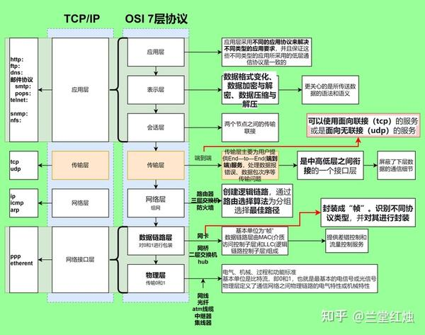  
下面我们对OSI模型和TCP/IP协议簇做具体介绍。

## OSI模型  
OSI（Open System Interconnect），即**开放式系统互连**。 一般都叫OSI参考模型，即OSI开放系统互连参考模型，是ISO组织在1985年研究的网络互连模型。该体系结构标准**定义了网络互连的七层框架，包括**物理层（RJ-45、SC）、数据链路层（PPP、以太网etherent、Wi-Fi(IEEE 802.11)、WiMAX(IEEE 802.16)、ATM、DTM、令牌环、FDDI、帧中继）、网络层（IP (IPv4和IPv6)、ICMP、IGMP、ARP、RARP）、传输层（tcp、udp）、会话层、表示层和应用层。

### 1 物理层  
物理层主要负责传输比特流，是OSI模型的最底层。物理层协议定义了数据传输的**物理媒体**，如双绞线、同轴电缆、光纤等，以及连接这些媒体的**各种接口标准**，如RJ-45、SC等。以太网、调制解调器、电力线通信(PLC)、SONET/SDH等都属于物理层的协议。

* RJ-45：RJ45是布线系统中信息插座（即通信引出端）连接器的一种，连接器由插头（接头、水晶头）和插座（模块）组成，插头有8个凹槽和8个触点。RJ是Registered Jack的缩写，意思是“注册的插座”。在FCC（美国联邦通信委员会标准和规章）中RJ是描述公用电信网络的接口，计算机网络的RJ45是标准8位模块化接口的俗称。
* SC端口：ST、SC、FC光纤接头。

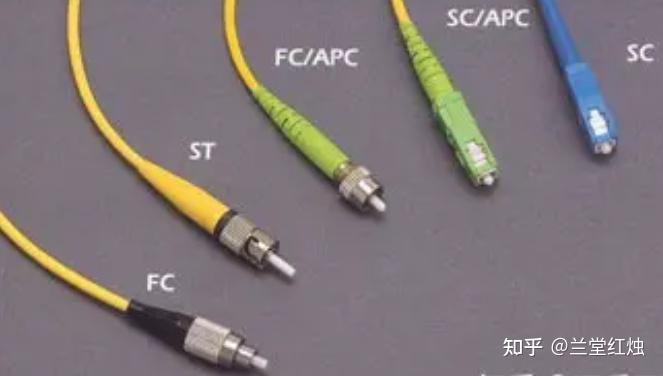  
### 2数据链路层  
数据链路层位于物理层之上，主要负责将原始的物理媒体转换成数据链路，使得数据能够在链路上进行传输。数据链路层协议**定义了数据帧的格式**、流量控制、错误检测和纠正等功能。PPP、以太网etherent、Wi-Fi(IEEE 802.11)、WiMAX(IEEE 802.16)、ATM、DTM、令牌环、FDDI、帧中继等都属于数据链路层的协议。

* PPP：点对点协议（Point to Point Protocol，PPP）为在点对点连接上传输多协议数据包提供了一个标准方法。PPP 最初设计是为两个对等节点之间的 IP 流量传输提供一种封装协议。在 TCP-IP 协议集中它是一种用来同步调制连接的数据链路层协议（OSI模式中的第二层），替代了原来非标准的第二层协议，即 SLIP。除了 IP 以外 PPP 还可以携带其它协议，包括 DECnet 和 Novell 的 Internet 网包交换（IPX）。
* etherent：以太网是一种计算机局域网技术。IEEE组织的IEEE 802.3标准制定了以太网的技术标准，它规定了包括物理层的连线、电子信号和介质访问层协议的内容。
* WI-FI：Wi-Fi是一个创建于IEEE 802.11标准的无线局域网技术。基于两套系统的密切相关，也常有人把Wi-Fi当作IEEE 802.11标准的同义术语。IEEE 802.11的设备已安装在市面上的许多产品，如：个人计算机、游戏机、MP3、智能手机、平板电脑、打印机、笔记本电脑以及其他可以无线上网的周边设备。
* wImAX：WiMAX(Worldwide Interoperability for MicrowaveAccess),即全球微波互联接入。WiMAX也叫802·16无线城域网或802.16。未普及
* ATM:
* DTM：动态同步转移模式(Dynamic Synchronous Transfer Mode，DTM)是一种基于电路交换，并辅以动态时隙分配的宽带网络结构。DTM的核心延用电路交换的基本思想，摒弃了复杂的ATM流量管理算法。作为第二层的交换/传输技术，DTM具有更强的带宽管理能力，适应光纤带宽的不断扩展，既支持现有的电信业务，又能有效地承载未来基于IP的多媒体。目前，DTM以其高效的协议、灵活的业务支持、强大的可扩展能力等显著优点，引起了ETSI等标准化组织的重视，它的标准化工作正在不断地完善，在未来网络中占据重要地位，很可能取代ATM。

### 3 网络层  
网络层负责将数据包从源端传输到目的端，主要功能是路由和转发。网络层协议定义了数据包的格式和路由的选择方式，同时还负责处理数据包的封装和解封装。IP (IPv4和IPv6)、ICMP、IGMP、ARP、RARP等都是网络层的协议。

* IP：IP是整个TCP/IP协议族的核心，也是构成互联网的基础。IP位于TCP/IP模型的网络层(相当于OSI模型的网络层)，它可以向传输层提供各种协议的信息，例如TCP、UDP等；对下可将IP信息包放到链路层，通过以太网、令牌环网络等各种技术来传送。IP主要包含三方面内容：IP编址方案、分组封装格式及分组转发规则。具体下面会详细讲解
* ICMP：ICMP提供一致易懂的出错报告信息。发送的出错报文返回到发送原数据的设备，因为只有发送设备才是出错报文的逻辑接受者。发送设备随后可根据ICMP报文确定发生错误的类型，并确定如何才能更好地重发失败的数据包。但是ICMP唯一的功能是报告问题而不是纠正错误，纠正错误的任务由发送方完成。在网络中经常会使用到ICMP协议，比如经常使用的用于检查网络通不通的Ping命令（Linux和Windows中均有），这个“Ping”的过程实际上就是ICMP协议工作的过程。还有其他的网络命令如跟踪路由的Tracert命令也是基于ICMP协议的。ICMP报文包含在IP数据报中，属于IP的一个用户，IP头部就在ICMP报文的前面，所以一个ICMP报文包括IP头部、ICMP头部和ICMP报文，IP头部的Protocol值为1就说明这是一个ICMP报文，ICMP头部中的类型（Type）域用于说明ICMP报文的作用及格式，此外还有一个代码（Code）域用于详细说明某种ICMP报文的类型，所有数据都在ICMP头部后面。ICMP报文格式具体由RFC 777 ，RFC 792 规范
* IGMP：Internet 组管理协议称为IGMP协议（Internet Group Management Protocol），是因特网协议家族中的一个组播协议。该协议运行在主机和组播路由器之间。IGMP协议共有三个版本，即IGMPv1、v2 和v3。
* ARP：地址解析协议，即ARP（Address Resolution Protocol），是根据IP地址获取物理地址的一个TCP/IP协议。OSI模型把网络工作分为七层，IP地址在OSI模型的第三层，MAC地址在第二层，彼此不直接打交道。在通过以太网发送IP数据包时，需要先封装第三层（32位IP地址）、第二层（48位MAC地址）的包头，但由于发送时只知道目标IP地址，不知道其MAC地址，又不能跨第二、三层，所以需要使用地址解析协议。使用地址解析协议，可根据网络层IP数据包包头中的IP地址信息解析出目标硬件地址（MAC地址）信息，以保证通信的顺利进行。需要了解的是ARP工作流程，ARP报文，ARP缓存，ARP命令。

### 4 传输层  
传输层负责将数据分段并传输到目标端，同时提供了可靠的数据传输服务和应用进程间的通信。传输层协议主要负责流量控制、错误控制和拥塞控制等功能。TCP和UDP是传输层的两个重要协议，它们提供了可靠的连接服务和无连接的数据报服务。

* TCP：传输控制协议（TCP，Transmission Control Protocol）是一种面向连接的、可靠的、基于字节流的传输层通信协议，由IETF的RFC793定义。
* UDP：用户数据报协议（UDP，User Datagram Protocol）.UDP 为应用程序提供了一种无需建立连接就可以发送封装的 IP 数据包的方法。

### 5 会话层  
### 6 表示层  
### 7 应用层  
应用层是五层协议的最顶层，直接面向用户提供应用程序的接口。应用层协议定义了应用程序之间的通信规则，如电子邮件、网页浏览等。HTTP、FTP、SMTP、DNS等都是应用层的协议。

### 帧  
上面我们说过，在数据链路层定义了帧的格式。在物理层，是0和1，数据链路层会加上mac地址封装为帧。

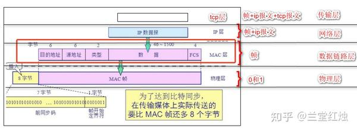  
MAC帧长度是需要在64~1518字节之间的，太长或者太短都是无效的帧。

IP数据包过来了，MAC 层会给分别使用6个字节为其加上“源mac地址”和“目标mac地址”，并且花2个字节为其指明是哪种类型的IP数据报(目前有IPV4,IPV6两种类型)，4字节“FCS帧检验序列” 负责检验帧是否有效，然后就是46~1500字节之间的IP数据报长度。

参考：[https://cloud.tencent.com/developer/article/1680970](https://cloud.tencent.com/developer/article/1680970)

### TCP/IP协议簇  
TCP/IP（Transmission Control Protocol/Internet Protocol，传输控制协议/网际协议）是指能够在多个不同网络间实现信息传输的协议簇。TCP/IP协议不仅仅指的是TCP 和IP两个协议，而是指一个由FTP、TCP、UDP、IP等协议构成的协议簇， 只是因为在TCP/IP协议中TCP协议和IP协议最具代表性，所以被称为TCP/IP协议。

**TCP / IP 协议簇**是Internet的基础，也是当今最流行的组网形式。 TCP/IP 是一组协议的代名词，包括许多别的协议，组成了TCP/IP协议簇。 其中比较重要的有 SLIP 协议、 PPP 协议、IP协议、 ICMP 协议、 ARP 协议、TCP协议、 UDP 协议、 FTP协议 、 DNS协议 、 SMTP 协议等。

TCP/IP协议是采用了4层模型，包括网络接口层，网络层，传输层和应用层。各层所代表的功能如下图所示，包括底3层所包含的设备。在整个协议中，物理层处于最底层。物理层包括电信号和光信号在内的物理信号和执行物理信号链路传输的设备。

这里主要详细讲解IP协议、TCP协议、UDP协议。

## IP协议  
IP协议指网际互连协议，Internet Protocol的缩写，是TCP/IP体系中的网络层协议。设计IP的目的是提高网络的可扩展性：一是解决互联网问题，实现大规模、异构网络的互联互通；二是分割顶层网络应用和底层网络技术之间的耦合关系，以利于两者的独立发展。根据端到端的设计原则，IP只为主机提供一种无连接、不可靠的、尽力而为的数据包传输服务。IP主要包含三方面内容：IP编址方案、分组封装格式及分组转发规则。

### IP编址方案  
IP规定网络上所有的设备都必须有一个独一无二的IP地址，就好比是邮件上都必须注明收件人地址，邮递员才能将邮件送到。同理，每个IP信息包都必须包含有目的设备的IP地址，信息包才可以正确地送到目的地。同一设备不可以拥有多个IP地址，所有使用IP的网络设备至少有一个唯一的IP地址。

IP地址是一个32位的标识符。包含2部分，网络号和主机号。**网络号**用来标识主机所连接的网络，**主机号：**用来标识连接在这个网络中的不同主机。ip地址分为A、B、C、D、E5类。A类地址是指32位的1个字节是网络号，后3个字节是主机号。[https://zh-hans.ipshu.com/ip-country/CN](https://zh-hans.ipshu.com/ip-country/CN)

IP地址可以划分子网。为了充分利用A类和B类地址空间**从主机号借用若干位作为子网号，**而主机号也就相应减少了若干位。划分子网后IP地址就变成了三级结构：主机号+子网号+主机号。

子网掩码，

### 帧的大小  

> 帧的大小不是固定的。在IEEE不同版本的协议中，可能不同，最小的帧是在在802.3标准里定义的。 IEEE802.3定义最小64byte,最大是1518byte。它规定了一个以太帧的数据部分(Payload)的最大长度是1500个字节。在这个限制之下，最长的以太帧包括6字节的目的地址(DMAC)、6字节的源地址(SMAC)、2字节的以太类型(EtherType)、1500字节的数据(Payload)、4字节的校验(FCS)，总共最大是1518字节。 在IEEE802.3ac增加了4byte,多出来那4byte是VLAN tag. 在802.1Q中，又定义了以太帧中可选的QTag，位于SMAC和EtherType之间，占4个字节。在这种情况下，一个以太帧如果有QTag，它的最大长度就变成了1522字节。 在802.1ad又定义了Q in Q，也就是说一个以太帧可以有多个QTag，每增加一个QTag，以太帧的最大长度就增加4个字节。 在十兆/百兆以太网的年代以后，到了千兆以太网出现以后，发现如果payload被限制在1500字节，传输效率不够高，所以又提出了Jumbo Frame的概念。 在一个Jumbo Frame中，Payload的长度是可以超过1500字节的，通常来说最高可以到9000字节，也就是Jumbo Frame最大大小是9K的。但并没有一个统一的标准，不是所有设备都支持...某些网卡就是支持了默认也是Disabled

### IP分组封装格式  
首先我们说一下IP分组。一个IP分组由**首部和数据**两部分组成。首部的前20字节是所有IP分组必须具有的，也称**固定首部**。在首部固定部分的后面是一些可选字段，其长度是可变的。具体见 [https://www.rfc-editor.org/rfc/rfc791#page-11](https://www.rfc-editor.org/rfc/rfc791#page-11)。首部各字段意义按顺序如下：

1. 版本（4位（0~4））：该字段定义IP协议版本，负责向处理机所运行的IP软件指明此IP数据报是哪个版本，所有字段都要按照此版本的协议来解释。如果计算机使用其他版本，则丢弃数据报。
2. 头部长度（4位（5~8）第1字节)：该字段定义数据报协议头长度，表示协议头部具有32位字长的数量。协议头最小值为5，最大值为15。
3. 服务（8位（9~16）第2字节)：该字段定义上层协议对处理当前数据报所期望的服务质量，并对数据报按照重要性级别进行分配。前3位成为优先位，后面4位成为服务类型，最后1位没有定义。这些8位字段用于分配优先级、延迟、吞吐量以及可靠性。
4. 总长度（16位（17~32）第3、4字节）：该字段定义整个IP数据报的字节长度，包括协议头部和数据。其最大值为65535字节。以太网协议对能够封装在一个帧中的数据有最小值和最大值的限制（46~1500个字节）。
5. 标识（16位（33~48））：该字段包含一个整数，用于识别当前数据报。当数据报分段时，标识字段的值被复制到所有的分段之中。该字段由发送端分配帮助接收端集中数据报分段。
6. 标记（3位）：该字段由3位字段构成，其中最低位（MF）控制分段，存在下一个分段置为1，否则置0代表该分段是最后一个分段。中间位（DF）指出数据报是否可进行分段，如果为1则机器不能将该数据报进行分段。第三位即最高位保留不使用，值为0。
7. 分段偏移（13位）：该字段指出分段数据在源数据报中的相对位置，支持目标IP适当重建源数据。
8. 生存时间（8位）：该字段是一种计数器，在丢弃数据报的每个点值依次减1直至减少为0。这样确保数据报拥有有限的环路过程（即TTL），限制了数据报的寿命。
9. 协议（8位）：该字段指出在IP处理过程完成之后，有哪种上层协议接收导入数据报。这个字段的值对接收方的网络层了解数据属于哪个协议很有帮助。
10. 头部校验和（16位）：该字段帮助确保IP协议头的完整性。由于某些协议头字段的改变，这就需要对每个点重新计算和检验。计算过程是先将校验和字段置为0，然后将整个头部每16位划分为一部分，将个部分相加，再将计算结果取反码，插入到校验和字段中。
11. 源地址（32位）：源主机IP地址，该字段在IPv4数据报从源主机到目的主机传输期间必须保持不变。
12. 目的地址（32位）：目标主机IP地址，该字段在IPv4数据报从源主机到目的主机传输期间同样必须保持不变。

IP协议内容具体可见下图

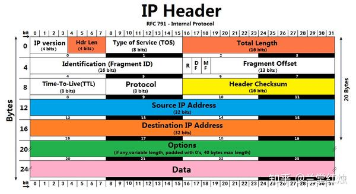  
### IP分片  
上面我们说过，物理层传输0和1，是物理链路。但是在数据链路层，对这些0和1进行了封装，将其包装为帧，也就是MTU最大传输单元。当要传输的数据加上IPHEADER大于MTU以后，需要进行IP分片。

**IP分片示例**

IP 数据报首部 20字节 , 数据部分 3800字节 ; 将其进行分片处理 : 每个分片不超过 1420字节 ; 标识 : 666 ; 标志 : DF = 0 , 表示允许分片 ; MF = 0 , 表示后续没有分片 ; 片偏移量 : 0

**分片后的结果是 :**分成 三片 

第一片 :

分片数据 : 首部 1( 20字节 ) + 1400字节数据部分 ; 标识 : 666 , 同一个分组的分片 , 标识相同 ; 标志 : DF = 0 , 允许分片 ; MF = 1 , 后续还有分片 ; 片偏移量 : 片偏移量 是 0 , 单位是 8字节 , 本片偏移量相当于 0 00 

第二片 :

分片数据 : 首部 2 ( 20 2020 字节 ) + 1400字节数据部分 ; 标识 : 666 , 同一个分组的分片 , 标识相同 ; 标志 : DF = 0 , 允许分片 ; MF = 1 , 后续还有分片 ; 片偏移量 : 片偏移量 是 175 , 单位是 8 字节 , 本片偏移量相当于 1400字节 ;

第三片 :

分片数据 : 首部 3( 20字节 ) + 1000字节数据部分 ; 标识 : 666, 同一个分组的分片 , 标识相同 ; 标志 : DF = 0 , 允许分片 ; MF = 0 , 后续没有分片 ; 片偏移量 : 片偏移量 是 350 , 单位是 8字节 , 本片偏移量相当于 2800字节 ;

片偏移量是从数据部分开始计数 , 数据部分的开始位置是 0字节 , 其单位是 8字节 , 片偏移量 1代表 8字节 ;

### 分组转发规则  
**路由器仅根据网络地址进行转发**。 当IP数据包经由路由器转发时，如果目标网络与本地 路由器 **直接相连**，则直接将数据包交付给目标主机，这称为**直接交付**；否则，路由器通过 路由表 查找路由信息，并将数据包转交给指明的下一跳路由器，这称为**间接交付**。

## TCP协议  
### TCP协议是什么  
TCP是[https://www.rfc-editor.org/rfc/rfc793#page-15](https://www.rfc-editor.org/rfc/rfc793#page-15)（rfc协议内容）的简写，指的是传输控制协议。在IP协议的基础上做了封装。TCP协议是一种面向连接的、可靠的、有序的、基于字节流的传输层通信协议。

其工作原理是应用层向TCP层发送用于网间传输的、用8位字节表示的数据流，然后TCP把数据流分区成适当长度的报文段（通常受该计算机连接的网络的数据链路层的最大传输单元（MTU）的限制）。之后TCP把结果包传给IP层，由它来通过网络将包传送给接收端实体的TCP层。

TCP为了保证不发生丢包，就给每个包一个序号，同时序号也保证了传送到接收端实体的包的按序接收。然后接收端实体对已成功收到的包发回一个相应的确认（ACK）；如果发送端实体在合理的往返时延（RTT）内未收到确认，那么对应的数据包就被假设为已丢失将会被进行重传。TCP用一个校验和函数来检验数据是否有错误；在发送和接收时都要计算校验和。

TCP的特点是面向连接的，需要经过3此握手和4此挥手。因为基于滑动窗口而可靠，滑动窗口机制包含差错检测，累计确认机制，序号，重传，计时器等功能。

我们知道应用层之间的通信本质是进程之间的通信，传输层接收(发送)应用层数据，传输层协议如果要连接的话得连接主机之间的进程才能完成通信(信息交换)。TCP连接通过三次挥手就是发送方主机A进程确定连接接收方主机B的某个进程，一旦连接，TCP协议会允许双方应用进程在任何时间段都可以发送和接收数据(全双工通信服务)，并且会提供发送和接收空间缓存。

### 全双工通信与半双工通信  
* 全双工通信:通信双方可以同时发送和接收信息(TCP实现)。
* 半双工通信:通信方式可以实现双向的通信，但不能在两个方向上同时进行，必须轮流交替地进行(数据链路层实现)

全双工通信：类似打电话的时候可以说话也可以听见对方说话。  
半双工通信: 好比对讲机，你一句我一句说话。

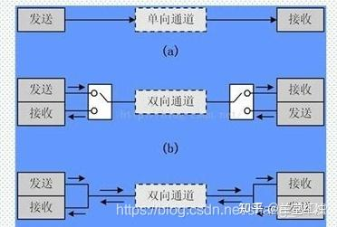  
**TCP采用的是全双工通信，这也是为什么三次握手建立连接，四次挥手释放连接**。

### TCP首部  
TCP首部定义在[https://www.rfc-editor.org/rfc/rfc793#page-15](https://www.rfc-editor.org/rfc/rfc793#page-15)中，下图是TCP头部的规范定义，它定义了TCP协议如何读取和解析数据：

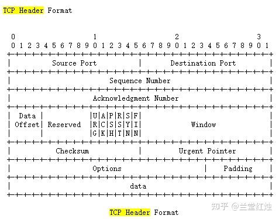  
  

TCP首部承载这TCP协议需要的各项信息，下面我们来分析一下：

* **TCP端口号**  
TCP的连接是需要四个要素确定唯一一个连接：  
**（源IP，源端口号）+ （目地IP，目的端口号）**  
所以TCP首部预留了两个16位作为端口号的存储，而IP地址由上一层IP协议负责传递  
源端口号和目地端口各占16位两个字节，也就是端口的范围是2^16=65535  
另外1024以下是系统保留的，从1024-65535是用户使用的端口范围
* **TCP的序号和确认号**：  
**32位序号 seq**：Sequence number 缩写seq ，TCP通信过程中某一个传输方向上的字节流的每个字节的序号，通过这个来确认发送的数据**有序**，比如现在序列号为1000，发送了1000，下一个序列号就是2000。  
**32位确认号 ack**：Acknowledge number 缩写ack，TCP对上一次seq序号做出的确认号，用来响应TCP报文段，给收到的TCP报文段的序号seq加1。
* **TCP的标志位**  
每个TCP段都有一个目的，这是借助于TCP标志位选项来确定的，允许发送方或接收方指定哪些标志应该被使用，以便段被另一端正确处理。  
用的最广泛的标志是 **SYN**，**ACK** 和 **FIN**，用于建立连接，确认成功的段传输，最后终止连接。
1. **SYN**：简写为`S`，同步标志位，用于建立会话连接，同步序列号；
2. **ACK**： 简写为`.`，确认标志位，对已接收的数据包进行确认；
3. **FIN**： 简写为`F`，完成标志位，表示我已经没有数据要发送了，即将关闭连接；
4. PSH：简写为`P`，推送标志位，表示该数据包被对方接收后应立即交给上层应用，而不在缓冲区排队；
5. RST：简写为`R`，重置标志位，用于连接复位、拒绝错误和非法的数据包；
6. URG：简写为`U`，紧急标志位，表示数据包的紧急指针域有效，用来保证连接不被阻断，并督促中间设备尽快处理；

### 3此握手  
所谓三次握手(Three-way Handshake)，是指建立一个 TCP 连接时，需要客户端和服务器总共发送3个报文。

三次握手的目的是连接服务器指定端口，建立 TCP 连接，并同步连接双方的序列号和确认号，交换 TCP 窗口大小信息。在 socket 编程中，客户端执行 connect() 时。将触发三次握手。

三次握手过程的示意图如下：

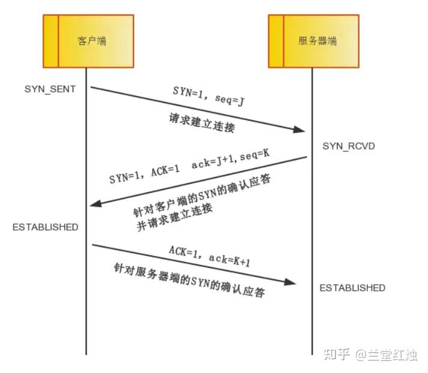  
**第一次握手**：

客户端将TCP报文**标志位SYN置为1**，随机产生一个序号值seq=J，保存在TCP首部的序列号(Sequence Number)字段里，指明客户端打算连接的服务器的端口，并将该数据包发送给服务器端，发送完毕后，客户端进入`SYN_SENT`状态，等待服务器端确认。

**第二次握手**：

服务器端收到数据包后由标志位SYN=1知道客户端请求建立连接，服务器端将TCP报文**标志位SYN和ACK都置为1**，ack=J+1，随机产生一个序号值seq=K，并将该数据包发送给客户端以确认连接请求，服务器端进入`SYN_RCVD`状态。

**第三次握手**：

客户端收到确认后，检查ack是否为J+1，ACK是否为1，如果正确则将标志位ACK置为1，ack=K+1，并将该数据包发送给服务器端，服务器端检查ack是否为K+1，ACK是否为1，如果正确则连接建立成功，客户端和服务器端进入`ESTABLISHED`状态，完成三次握手，随后客户端与服务器端之间可以开始传输数据了。

注意:我们上面写的ack和ACK，不是同一个概念：

* 小写的ack代表的是头部的确认号Acknowledge number， 缩写ack，是对上一个包的序号进行确认的号，ack=seq+1。
* 大写的ACK，则是我们上面说的TCP首部的标志位，用于标志的TCP包是否对上一个包进行了确认操作，如果确认了，则把ACK标志位设置成1。

### 四次挥手关闭连接  
四次挥手即终止TCP连接，就是指断开一个TCP连接时，需要客户端和服务端总共发送4个包以确认连接的断开。在socket编程中，这一过程由客户端或服务端任一方执行close来触发。由于TCP连接是全双工的，因此，每个方向都必须要单独进行关闭，这一原则是当一方完成数据发送任务后，发送一个FIN来终止这一方向的连接，收到一个FIN只是意味着这一方向上没有数据流动了，即不会再收到数据了，但是在这个TCP连接上仍然能够发送数据，直到这一方向也发送了FIN。首先进行关闭的一方将执行主动关闭，而另一方则执行被动关闭。

四次挥手过程的示意图如下：

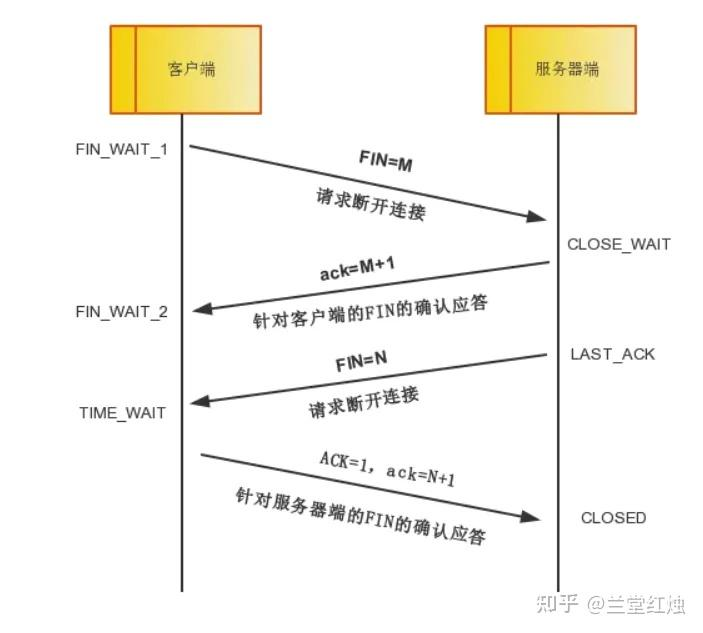  
挥手请求可以是Client端，也可以是Server端发起的，我们假设是Client端发起：

* **第一次挥手**： Client端发起挥手请求，向Server端发送标志位是FIN报文段，设置序列号seq，此时，Client端进入`FIN_WAIT_1`状态，这表示Client端没有数据要发送给Server端了。 client——>server : 说完了，请求关闭
* **第二次分手**：Server端收到了Client端发送的FIN报文段，向Client端返回一个标志位是ACK的报文段，ack设为seq加1，Client端进入`FIN_WAIT_2`状态，Server端告诉Client端，我确认并同意你的关闭请求。server——>client: 好的，可以关闭了
* **第三次分手**： Server端向Client端发送标志位是FIN的报文段，请求关闭连接，同时Client端进入`LAST_ACK`状态。server——>client : 你关闭吧。
* **第四次分手** ： Client端收到Server端发送的FIN报文段，向Server端发送标志位是ACK的报文段，然后Client端进入`TIME_WAIT`状态。Server端收到Client端的ACK报文段以后，就关闭连接。此时，Client端等待**2MSL**的时间后依然没有收到回复，则证明Server端已正常关闭，那好，Client端也可以关闭连接了。client——>server : 好的，然后等待2MSL关闭（MSL是Maximum Segment Lifetime英文的缩写，中文可以译为“报文最大生存时间”）

> client——>server : 说完了，要关闭了  
> server——>client: 好的，可以关闭了  
> server——>client : 你关闭吧  
> client——>server : 好的，然后等待2MSL关闭

### 为什么连接的时候是三次握手，关闭的时候却是四次握手？  
建立连接时因为当Server端收到Client端的SYN连接请求报文后，可以直接发送**SYN+ACK**报文。其中ACK报文是用来应答的，SYN报文是用来同步的。所以建立连接只需要三次握手。

由于TCP协议是一种面向连接的、可靠的、基于字节流的运输层通信协议，TCP是**全双工模式**。这就意味着，关闭连接时，当Client端发出FIN报文段时，只是表示Client端告诉Server端数据已经发送完毕了。当Server端收到FIN报文并返回ACK报文段，表示它已经知道Client端没有数据发送了，但是Server端还是可以发送数据到Client端的，所以Server很可能并不会立即关闭SOCKET，直到Server端把数据也发送完毕。当Server端也发送了FIN报文段时，这个时候就表示Server端也没有数据要发送了，就会告诉Client端，我也没有数据要发送了，之后彼此就会愉快的中断这次TCP连接。

### 为什么要等待2MSL？  
**MSL**：报文段最大生存时间，它是任何报文段被丢弃前在网络内的最长时间。有以下两个原因：

* **第一点：保证TCP协议的全双工连接能够可靠关闭**：  
由于IP协议的不可靠性或者是其它网络原因，导致了Server端没有收到Client端的ACK报文，那么Server端就会在超时之后重新发送FIN，如果此时Client端的连接已经关闭处于`CLOESD`状态，那么重发的FIN就找不到对应的连接了，从而导致连接错乱，所以，Client端发送完最后的ACK不能直接进入`CLOSED`状态，而要保持`TIME_WAIT`，当再次收到FIN的收，能够保证对方收到ACK，最后正确关闭连接。
* **第二点：保证这次连接的重复数据段从网络中消失**  
如果Client端发送最后的ACK直接进入`CLOSED`状态，然后又再向Server端发起一个新连接，这时不能保证新连接的与刚关闭的连接的端口号是不同的，也就是新连接和老连接的端口号可能一样了，那么就可能出现问题：如果前一次的连接某些数据滞留在网络中，这些延迟数据在建立新连接后到达Client端，由于新老连接的端口号和IP都一样，TCP协议就认为延迟数据是属于新连接的，新连接就会接收到脏数据，这样就会导致数据包混乱。所以TCP连接需要在TIME\_WAIT状态等待2倍MSL，才能保证本次连接的所有数据在网络中消失。

### 滑动窗口  
  

在首部中，又一个window字段。RFC793对它的解释是"发送方希望接收到的以ACK标志开头的数据字节数"。滑动窗口是跟ACK一起的，因此ACK标志必须置为1，同时指定窗口大小。可以看到，滑动窗口大小通过16个bit来描述，所以变化范围0-65535（这个范围其实是可以缩放的）。

> Window: 16 bits  
>  The number of data octets beginning with the one indicated in the  
>  acknowledgment field which the sender of this segment is willing to  
>  accept.

引入窗口概念的原因。我们都知道 TCP 是每发送一个数据，都要进行一次确认应答。当上一个数据包收到了应答了， 再发送下一个。这个模式就有点像我和你面对面聊天，你一句我一句。但这种方式的缺点是效率比较低的。如果你说完一句话，我在处理其他事情，没有及时回复你，那你不是要干等着我做完其他事情后，我回复你，你才能说下一句话，很显然这不现实。

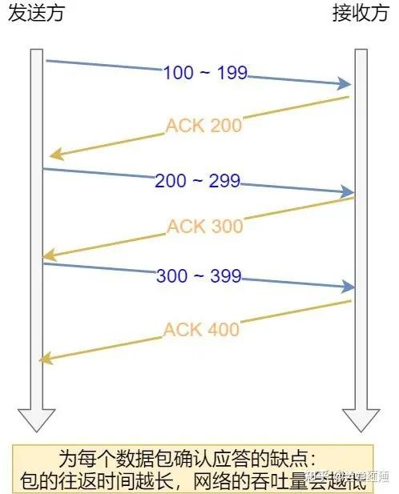  
按数据包进行确认应答

所以，这样的传输方式有一个缺点：数据包的**往返时间越长，通信的效率就越低**。

为解决这个问题，TCP 引入了**窗口**这个概念。即使在往返时间较长的情况下，它也不会降低网络通信的效率。

那么有了窗口，就可以指定窗口大小，窗口大小就是指**无需等待确认应答，而可以继续发送数据的最大值**。

窗口的实现实际上是操作系统开辟的一个缓存空间，发送方主机在等到确认应答返回之前，必须在缓冲区中保留已发送的数据。如果按期收到确认应答，此时数据就可以从缓存区清除。

假设窗口大小为 3 个 TCP 段，那么发送方就可以「连续发送」 3 个 TCP 段，并且中途若有 ACK 丢失，可以通过「下一个确认应答进行确认」。如下图：

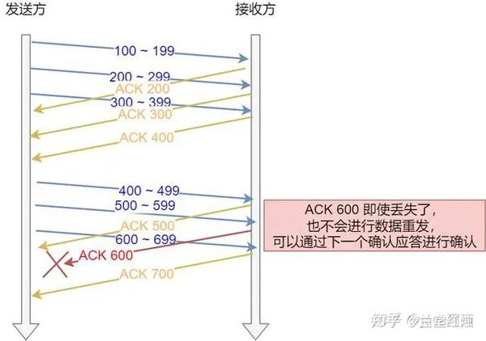  
用滑动窗口方式并行处理

图中的 ACK 600 确认应答报文丢失，也没关系，因为可以通话下一个确认应答进行确认，只要发送方收到了 ACK 700 确认应答，就意味着 700 之前的所有数据「接收方」都收到了。这个模式就叫**累计确认**或者**累计应答**。

我们先来看看发送方的窗口，下图就是发送方缓存的数据，根据处理的情况分成四个部分，其中深蓝色方框是发送窗口，紫色方框是可用窗口：

  

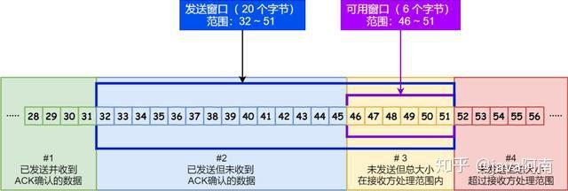  
  

  

* #1 是已发送并收到 ACK确认的数据：1~31 字节
* #2 是已发送但未收到 ACK确认的数据：32~45 字节
* #3 是未发送但总大小在接收方处理范围内（接收方还有空间）：46~51字节
* #4 是未发送但总大小超过接收方处理范围（接收方没有空间）：52字节以后

在下图，当发送方把数据「全部」都一下发送出去后，可用窗口的大小就为 0 了，表明可用窗口耗尽，在没收到 ACK 确认之前是无法继续发送数据了。

  

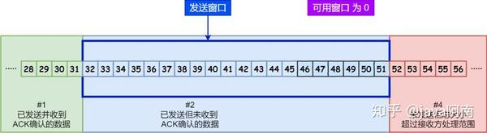  
  

可用窗口耗尽

在下图，当收到之前发送的数据 32~36 字节的 ACK 确认应答后，如果发送窗口的大小没有变化，则**滑动窗口往右边移动 5 个字节，因为有 5 个字节的数据被应答确认**，接下来 52~56 字节又变成了可用窗口，那么后续也就可以发送 52~56 这 5 个字节的数据了。

  

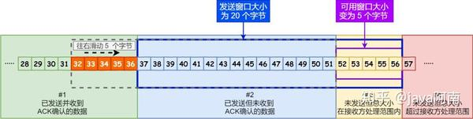  
  

32 ~ 36 字节已确认

  

> 本篇内容，部分为摘录其他优秀文章。  
> TCP连接：https://zhuanlan.zhihu.com/p/108504297   
> 帧：[https://cloud.tencent.com/developer/article/1680970](https://cloud.tencent.com/developer/article/1680970)  
> 滑动窗口：[https://zhuanlan.zhihu.com/p/135932018](https://zhuanlan.zhihu.com/p/135932018)

